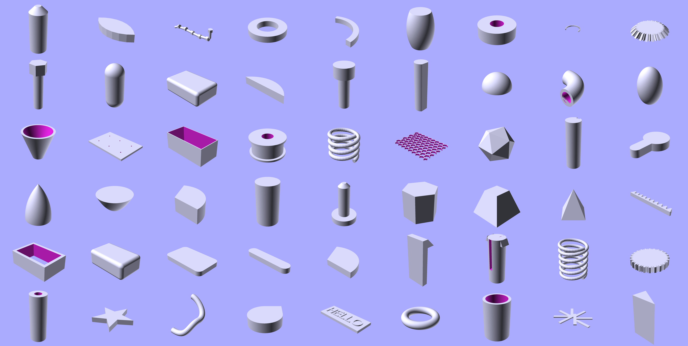

# SCADwright

SCADwright is a Python library for designing 3D parts and assemblies: you write Python; SCADwright generates an OpenSCAD source file that renders into STL (or any other format OpenSCAD supports).

## What is this and why does it exist?

While OpenSCAD offers a straight-forward and easy path to programmatic 3d design, it is severely limited in ways that rapidly get annoying once your project grows beyond a few parts.

**SCADwright keeps the basic OpenSCAD model and primitives, but SCADwright goes way beyond just a python wrapper,  offering additional functionality not easily possible with OpenSCAD**:

 - equation-based components with externally accessible attributes and bounding boxes.
 - ability to add new transforms to the language
 - a library of reusable shapes out of the box
 - auto-EPS adjustment on difference() and union()
 - surface-based attachment
 - smart centering built into new components by default
 - separate print/display/debug views
 - scripts you can parametrize from the command line
 - real error messages with line numbers
 - and automated tests

While simple projects very strongly resemble OpenSCAD code (easy to be productive immediately), as your projects grow in complexity, **SCADwright allows a graceful transition to more complex features**, without any hard syntactic or conceptual boundaries. **Styles can be mixed and matched in the same project.**

I have put significant effort into refining the UX of SCADwright:  the more advanced constructs use a syntax 
that's neither OpenSCAD nor quite standard object-oriented python. Instead, the goal is to **ruthlessly 
eliminate boiler plate,** and make constructs simple to use in common cases for those with little background in
object-oriented python or advanced OpenSCAD, while retaining full python capabilities and a low-level interface
for exceptional cases.

SCADwright calls OpenSCAD only at render time. The Python side has no external dependencies, but sympy is highly recommended to enable full functionality.  I've taken some care to make emitted SCAD relatively human-readable.

If you're comparing SCADwright against SolidPython, PythonSCAD, CadQuery, Build123d, or other Python+CAD tools, see [How is SCADwright different?](docs/how_is_scadwright_different.md) for a side-by-side.

The [quick start / organizing a project guide](docs/organizing_a_project.md) is the best place to see the power of SCADwright in action. 


## SCADwright systematically addresses the most painful aspects of OpenSCAD:

Here's 15 different OpenSCAD vexations which SCADwright solves...


### 1. Modules can't expose what they know

When you write a parametric module in OpenSCAD — say a bracket with mount-hole positions — the caller has no way to ask where those holes are. You either compute the offsets in two places, or hard-code them.

In SCADwright, parametric parts are [Python classes](docs/components.md). The caller can read any attribute of other Components freely.

```python
from scadwright import Component
from scadwright.primitives import cube

class Bracket(Component):
    equations = ["width, height > 0"]

    def build(self):
        return cube([self.width, self.width, self.height])

b = Bracket(width=80, height=5)
print(b.width)               # readable; no geometry built yet
```

### 2. Dimensional relationships live in your head, not the code

A hollow tube has an outer diameter, an inner diameter, and a wall thickness, linked by `od == id + 2*thk`. In OpenSCAD you either write three modules (`tube_by_id_thk`, `tube_by_od_thk`, `tube_by_id_od`) or one module with conditional logic. The relationship lives in a comment; the code just enumerates cases. And if a wall thickness must be positive, you write an `assert()` that fires at render time -- after you've already waited.

In SCADwright, you write a Component, declaring relationships and constraints together as [equations](docs/components.md). When you want to use the Component, supply whatever combination of arguments you want. The framework automatically works out a solution, if it can.  Otherwise, you get a specific error:  malformed (not an equation), insufficient (provided arguments can't solve the equations), inconsistent (constraint failed, or provided arguments generate inconsistent solutions), and ambiguous (multiple discrete solutions, usually fixable with a >0 constraint)

You don't even need to isolate a variable on the left of the equation like you do with programming languages.

```python
from scadwright import Component

class Tube(Component):
    equations = [
        "od - id = 2*thk",                 # structural relationship: solve for the missing one
        "h, id, od, thk > 0",              # constraints
    ]

    def build(self): ...

Tube(h=10, id=8, thk=1)      # od solved = 10
Tube(h=10, id=8, od=10)      # thk solved = 1
Tube(h=10, od=10, thk=1)     # id solved = 8
Tube(h=10, id=8, thk=-1)     # ValidationError: thk must be positive
```

And equations aren't limited to scalar arithmetic. Either side can be any Python expression: build a tuple with a comprehension, pick between values with a conditional, read fields and items off the inputs.

```python
class BatteryHolder(Component):
    spec = Param(BatterySpec)
    count = Param(int, positive=True)
    equations = [
        "wall_thk, clearance > 0",
        "pitch = spec.d + 2*clearance",                           # field read on a namedtuple input
        "outer_w = count * pitch + 2*end_clearance",              # arithmetic
        "positions = tuple(i*pitch for i in range(count))",       # tuple from a comprehension
        "edge = fillet if is_filleted else chamfer",              # conditional
        "len(size) = 3",                                          # consistency check on an input
    ]
```

### 3. You can't add new transforms or other "verbs"

In OpenSCAD you can't write `cube(10).chamfer_top(depth=1)` — there's no way to add a transform that works on any shape.

In SCADwright, [register a transform](docs/custom_transforms.md) once and it becomes a method on every shape:

```python
from scadwright.boolops import minkowski
from scadwright.primitives import cube, sphere
from scadwright.transforms import transform

@transform("chamfer_top")
def chamfer_top(node, *, depth):
    return minkowski(node, sphere(r=depth, fn=8))

part = cube([10, 10, 5]).chamfer_top(depth=1)
```

Built-in [`add_text()`](#6-putting-text-on-a-part-is-a-project-of-its-own) is one example — see below.


### 4. Every union/difference needs manual epsilon overlap

In OpenSCAD, when two shapes share a face in a `difference()` or `union()`, the result has artifacts unless you manually extend the shapes by a tiny epsilon. Every project defines `eps = 0.01` and litters it through every cut and join.

SCADwright handles this automatically.

```python
from scadwright.boolops import difference, union
from scadwright.primitives import cube, cylinder

box = cube([20, 20, 10])
part = difference(box, cylinder(h=10, r=3).through(box))     # through-hole, no manual eps
```

`through(parent)` detects which faces of the cutter are flush with the parent and extends them automatically. For joints, `attach(fuse=True)` overlaps parts at the contact face. See [Eliminating epsilon overlap](docs/auto-eps_fuse_and_through.md).

### 5. You spend half your time on geometry that isn't your actual project

OpenSCAD has no module library. Every project starts with reinventing tubes, rounded rectangles, and screw holes. Need an M3 bolt? Look up the head diameter, compute the hex profile, get the clearance hole size right. Need a gear? That's a week.

SCADwright ships a [shape library](docs/shapes/) with 50+ ready-made Components across mechanical, fastener, gear, and print-oriented categories:



```python
from scadwright.shapes import Tube, SpurGear, Bolt, HexNut, HoneycombPanel, Bearing

cap = Tube(h=10, id=8, thk=1)                    # od solved: 10
gear = SpurGear(module=2, teeth=20, h=5)          # involute profile; .pitch_r readable on the instance
bolt = Bolt(size="M3", length=10)                 # ISO dimensions from data tables
bearing = Bearing.of("608")                       # 8x22x7, ready for fit-check
panel = HoneycombPanel(size=(80, 60, 3), cell_size=8, wall_thk=1)
```

Every shape is a Component -- you can read its computed dimensions, attach other parts to it, and pass it into boolean operations. See the [shape library docs](docs/shapes/) for the full catalog.

Fit tolerances flow project-wide. Set `Clearances(sliding=0.05, press=0.08, snap=0.2, finger=0.2)` once on your `Design` class and every `AlignmentPin`, `PressFitPeg`, `SnapPin`, and `TabSlot` inherits automatically; override per-scope, per-Component, or per-call. See [Clearances](docs/clearances.md).

### 6. Putting text on a part is a project of its own

In OpenSCAD, putting a label on a part means doing the math yourself: build the 2D `text()`, `linear_extrude` it, then `translate`/`rotate` it onto the face — and that only works on a flat face. Wrapping a label around a cylinder or up the side of a funnel means hand-rolling per-glyph placement around an arc, or giving up.

SCADwright provides [`add_text()`](docs/add_text.md) as a chained method on every shape. One call places raised or inset text on any flat face, cylindrical wall, conical wall, or disk rim:

```python
from scadwright.primitives import cube, cylinder
from scadwright.shapes import Tube, Funnel

plate = cube([60, 30, 2], center="xy")
plate.add_text(label="HELLO", relief=0.5,  on="top",   font_size=8)              # raised on a flat face
plate.add_text(label="v1.0",  relief=-0.3, on="top",   font_size=4, at=(0, -8))  # inset, offset within the face

cyl = cylinder(h=20, r=10)
cyl.add_text(label="BRAND", relief=0.4, on="outer_wall", font_size=4,
             meridian="front")                                                   # wrapped around the cylinder

Funnel(h=30, bot_od=20, top_od=40, thk=2).add_text(
    label="0.5L", relief=0.4, on="outer_wall", font_size=4, text_orient="slant", # wraps a tapered cone
)

Tube(h=30, od=24, thk=2).add_text(
    label="LOT 7", relief=-0.3, on="inner_wall", font_size=4,                    # text on the inside surface
)

cylinder(h=10, r=15).add_text(label="MAX 5L", relief=0.4, on="top", font_size=3) # arc-wrapped along the rim
```

`relief` is signed: positive raises, negative cuts (and cuts deeper than the wall punch through).

`on=` takes any face name — flat faces (`top`, `rside`, …), curved walls (`outer_wall`, `inner_wall` on `cylinder()`, `Tube`, and `Funnel`), disk rims, or any custom anchor a Component declares. Cylindrical and conical placements use `meridian=` (string name or numeric degrees) and `at_z=` to position around and along the axis; rim text uses `at_radial=` for the path radius.

Multi-line labels stack the right way for each surface — vertically on a face, axially on a wall, radially on a rim — and the host's anchors survive the call, so labels chain and `attach()` still works afterwards.

See [`add_text()`](docs/add_text.md) for the full reference.


### 7. No clean separation between display and print variants

Often the best way to print a part is very different from how you want to see it. A part might need supports, or to be re-oriented, or cut in half for printing. For display, you might want to see parts mated together or show stand-in hardware.

In OpenSCAD this becomes commented-out blocks, duplicated files, or fragile flags.

SCADwright has a `Design` class with named [`@variant` methods](docs/variants.md):

```python
from scadwright.boolops import union
from scadwright.design import Design, run, variant

class Widget(Design):
    box = MyBox()
    lid = MyLid(box=box)

    @variant(fn=48, default=True)
    def print(self):
        return union(self.box, self.lid.right(80))

    @variant(fn=48)
    def display(self):
        return union(self.box, self.lid.up(self.box.height))

if __name__ == "__main__":
    run()
```

```
scadwright build widget.py --variant=print
scadwright build widget.py --variant=display
```


### 8. Positioning parts relative to each other requires manual coordinate math

In OpenSCAD, stacking a lid on a box means computing `translate([0, 0, box_height])` by hand. If you add a spacer or change a dimension, every downstream offset needs updating.

SCADwright's [`attach()` method](docs/anchors.md) lets you position parts by naming which faces should touch:

```python
from scadwright.primitives import cube, cylinder

plate = cube([40, 40, 2])
peg   = cylinder(h=10, r=3).attach(plate)                   # bottom on top
cap   = cube([8, 8, 2]).attach(peg, face="top")              # cap on top of peg
```

Insert a spacer between any two parts and nothing downstream needs to change. Components can declare custom named anchors for semantically meaningful attachment points.

See [Anchors and attachment](docs/anchors.md) for the full reference.

### 9. You can't reason about a part's size without rendering it

In OpenSCAD, the only way to know how big something is -- whether it fits on your print bed, whether two parts overlap, whether a lid is wider than its box -- is to render it and eyeball the result.

SCADwright [computes bounding boxes from the AST](docs/introspection.md), without rendering. You can query them, assert against them, and use them to position parts relative to each other:

```python
from scadwright import bbox
from scadwright.asserts import assert_fits_in, assert_no_collision

bb = bbox(my_widget)
print(bb.size)                             # (width, length, height)

assert_fits_in(my_widget, [200, 200, 50])  # fits on the print bed?
assert_no_collision(box, lid)              # parts don't overlap?
```

### 10. Centering parts is manual and repetitive

In OpenSCAD, `center=true` works on primitives but not on modules. If your module builds a shape at the origin and you want it centered, you compute the offset yourself. Every module that needs centering reinvents the same translate-by-half-size logic.

In SCADwright, every Component accepts [`center=`](docs/primitives_3d.md) as a constructor kwarg -- same syntax as `cube(center=...)`, with per-axis control:

```python
from scadwright.shapes import UShapeChannel

u = UShapeChannel(wall_thk=2, channel_length=50, channel_width=10, center="xy")
u.outer_width                              # still readable -- it's still a Component
```

The Component author doesn't write any centering code. The framework computes the bounding box after `build()` and translates the requested axes to the origin. For Components where the geometric center isn't the right reference point, override `center_origin()` to return a custom one.


### 11. Transforms read backwards

In OpenSCAD, the verb comes before the noun: you write the rotate-then-translate first, then the shape they apply to. Reading the code, you have to scan to the end of a line to see what's actually moving.

SCADwright puts the shape first. [Operations chain off the shape](docs/transformations.md):

```python
from scadwright.primitives import cube

cube([10, 20, 30]).up(5).rotate([0, 45, 0]).red()
```


### 12. Errors don't tell you where they came from

OpenSCAD's error messages typically point at the rendered output, not your source. Tracking down which call produced a bad value is manual.

SCADwright [errors](docs/errors_and_logging.md) carry the file and line of your call:

```python
from scadwright.primitives import cube

cube([-5, 10, 10])
# ValidationError: cube size[0] must be non-negative, got -5.0 (at widget.py:42)
```


### 13. Scripts can't declare command-line parameters

OpenSCAD takes `-D foo=10`, but scripts can't say what parameters they accept, what types they expect, or what defaults to use. The contract lives in comments.

[SCADwright scripts](docs/cli_and_args.md) declare parameters explicitly:

```python
from scadwright import arg, render
from scadwright.boolops import difference
from scadwright.primitives import cube, cylinder

width = arg("width", default=40, type=float, help="widget width in mm")

MODEL = difference(
    cube([width, width, 20], center="xy"),
    cylinder(h=22, r=5, center=True),
)

render(MODEL, "widget.scad")
```

```
scadwright build widget.py --width=80
scadwright build widget.py --help          # lists arguments with defaults
```

### 14. Resolution ($fn) is tedious to manage

In OpenSCAD, you either set `$fn` globally (too coarse) or pass it to every single primitive call (tedious and easy to miss one). There's no middle ground.

In SCADwright, [resolution (`fn`, `fa`, `fs`)](docs/resolution.md) flows automatically through the hierarchy. Set it once at the level that makes sense and every primitive below inherits it:

```python
from scadwright.shapes import Tube

# Per-instance: pass fn when constructing a Component
cap = Tube(h=10, id=8, thk=1, fn=64)

# Per-variant: set fn in the @variant decorator and every Component
# and primitive built inside that variant inherits it
@variant(fn=48, default=True)
def print(self):
    return self.housing     # all primitives inside get fn=48

# Per-scope: wrap any block of code
with resolution(fn=128):
    high_res_part = difference(sphere(r=10), sphere(r=8))
```

No declaration needed on the Component side — `fn` is accepted by every Component automatically and flows into the resolution context for its `build()` method.


### 15. You can't tell if a part has changed

OpenSCAD has no way to write a regression test that says "this part hasn't changed since I last reviewed it." You either re-render and visually compare, or trust that your edit didn't break anything.

SCADwright [hashes the geometry tree](docs/testing.md) so you can pin a part's shape in a unit test:

```python
from scadwright import tree_hash

def test_widget_geometry_pinned():
    assert tree_hash(Widget(width=40)) == "a1b2c3d4e5f6..."
```

If any dimension, transform, or boolean op changes, the hash changes and the test fails -- before you ever open OpenSCAD.


## Quick example

```python
from scadwright import render
from scadwright.boolops import difference
from scadwright.primitives import cube, cylinder

body = cube([40, 40, 20], center="xy")
hole = cylinder(h=22, r=5, center=True, fn=64)

part = difference(
    body,
    hole.right(10),
    hole.left(10),
)

render(part, "widget.scad")
```

Run with `python widget.py` (writes `widget.scad`) or use the CLI: `scadwright build widget.py`. Open the result in OpenSCAD to render.

## Quick example (with a Component)

When a part has named dimensions and relationships between them, wrap it in a Component:

```python
from scadwright import Component, render
from scadwright.boolops import difference
from scadwright.primitives import cylinder

class Tube(Component):
    equations = [
        "od = id + 2*thk",
        "h, id, od, thk > 0",
    ]

    def build(self):
        return difference(
            cylinder(h=self.h, r=self.od / 2),
            cylinder(h=self.h + 2, r=self.id / 2).down(1),
        )

t = Tube(h=30, id=20, thk=2)      # od solved = 24.0
print(t.od)                        # 24.0 -- readable without rendering
render(t, "tube.scad")
```

## Quick example (with a Component and @variant)

Building on the Tube above, add a Design with variants -- a display view showing the tube upright, and a print view that halves it into two concave-down pieces spaced apart for the print bed:

```python
from scadwright import Component, bbox
from scadwright.boolops import difference, union
from scadwright.design import Design, run, variant
from scadwright.primitives import cylinder

class Tube(Component):
    equations = [
        "od = id + 2*thk",
        "h, id, od, thk > 0",
    ]

    def build(self):
        return difference(
            cylinder(h=self.h, r=self.od / 2),
            cylinder(h=self.h + 2, r=self.id / 2).down(1),
        )

class MyTube(Tube):
    h = 30
    id = 20
    thk = 2

class TubeProject(Design):
    tube = MyTube()

    @variant(fn=64, default=True)
    def display(self):
        return self.tube

    @variant(fn=64)
    def print(self):
        half = self.tube.halve([0, -1, 0])          # cut in half along Y
        spacing = bbox(half).size[1] + 5
        return union(
            half,                                    # concave side down
            half.forward(spacing),
        )

if __name__ == "__main__":
    run()
```

```
scadwright build tube.py                     # display variant (default)
scadwright build tube.py --variant=print     # two halves, bed-ready
```

## Install

```
pip install -e '.[dev]'
pytest                                 # unit + golden tests
SCADWRIGHT_TEST_OPENSCAD=1 pytest        # also OpenSCAD round-trip tests
```

The `scadwright` command becomes available.

## Dependencies

SCADwright has no required dependencies beyond Python's standard library, however, equation solving (the `equations` class attribute) requires sympy, installed via `pip install 'scadwright[equations]'`.  Installing this is highly recommended for the full functionality of SCADwright.


## VS Code extension 

Included in this project is [a Visual Studio Code extension](/vscode/) that detects when you open a python SCADwright file and shows icons to preview in OpenSCAD, render to a file, or kill any OpenSCAD instances.  

This makes it simple to see the results of changes with a single click.  As long as the generated filename is the same (i.e. you're invoking the same variant), clicking preview will auotmatically update the code in an open OpenSCAD instance and re-preview it, saving the time of closing and re-opening the application.

## SCADwright and modeling with AI

Compared to OpenSCAD, building a model wiht AI in SCADwright (and the MCP below) is faster and lets you take bigger steps than just building in OpenSCAD directly.

But don't make my word for it.  From the horses mouth:
 - equations and constraints catch a lot of lazy or under-specified mistakes with explicit errors - ones that, in OpenSCAD, might otherwise might result in a less scrutable error or slip through entirely 
 - higher level abstractions (like `attach(fuse=True)`, `through()`, custom transforms, `add_text()`, etc.) are closer to what the user describes and require less interpretation/translation into code
 - AI is much better writing at python than openscad, reflecting the relative popularity of python in training data 

Whichever AI assistant you use, dropping the [style guide](docs/style-guide.md) into its context steers generated code away from generic-Python habits toward SCADwright's idioms.


### MCP

If you're developing with Claude Code, install the [OpenSCAD MCP server](https://github.com/quellant/openscad-mcp). It gives Claude the ability to render your `.scad` output, visually inspect the result, and catch geometry errors without you having to open OpenSCAD yourself. SCADwright's generated SCAD is fully compatible -- Claude can build your script, render it through the MCP, and iterate on the design in a tight feedback loop.


## Is this AI generated slop?

I've been working on the specification for this for years, long before AI was a thing.

Is there AI generated code in here?  Yes.  It's 2026.  

Is this one-shot-slop?  No.  It's the result of hundreds, maybe thousands, of incremental iterations, and a fair amount of hand-coding and human-writing (including this bit right here).

Pretty much every part of SCADwright has gone through at least 5-6 major revisions, reducing duplicate and boilerplate code, making the constructs intutive and naively simple, and working through hard trade-offs in detail though examples.  I've been writing code longer than Python has been a language (and I've been writing serious code longer than Python has been a serious language) - I wouldn't put my name on something that's dogshit or poorly thought out.   Hell, I even went to the effort to make the emitted SCAD human-readable.

In parallel, I'm actually using this framework for my current 3d printing projects: the [Bronica S2 lens housing](/examples/lens-housing.py) and [convex lens caliper attachment](/examples/convex-caliper.py) both leverage this 
framework and motivated its completion.

## Documentation

I've taken great care to produce excellent documentation that's easy to consume.  This is not an AI-generated afterthought, but rather carefully written docs for producing expressive and powerful code simply.

[Full documentation here](docs/README.md). Documentation is along the lines of the [OpenSCAD Language Reference](https://openscad.org/documentation.html).  There's also a [cheatsheet](docs/cheatsheet.md) that parallels [the OpenSCAD cheatsheet](https://openscad.org/cheatsheet/).

For a quick intro, see [How to organize a project](docs/organizing_a_project.md).

This framework also includes [examples of projects at various levels of difficulty click](examples/README.md)

If you're comparing SCADwright against SolidPython, PythonSCAD, CadQuery, Build123d, or other Python+CAD tools, see [How is SCADwright different?](docs/how_is_scadwright_different.md) for a side-by-side.
