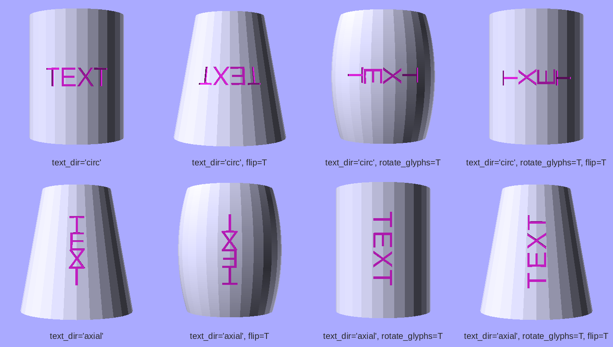

# Text on a surface with `add_text()`

`add_text()` puts raised or inset text on any flat face, cylindrical wall, conical wall, or rim of a host shape. Placement uses [anchors](anchors.md), the same system `attach()` uses. Any face name or custom anchor on the host is a valid label location, and the parametric placement options (`angle=`, `at_z=`, `at_radial=`) mean the same things they do in [attach()](attach.md#placement-on-cylinders-cones-and-spheres). After `add_text()`, the host's anchors stay intact, so you can chain more labels or call `attach()`.

```python
from scadwright.primitives import cube
from scadwright.shapes import Tube
```

## The 30-second version

```python
plate = cube([40, 15, 2], center="xy")

plate.add_text(label="HELLO", relief=0.5, on="top", font_size=8)   # raised
plate.add_text(label="v1.0",  relief=-0.3, on="top", font_size=4)  # inset
```

`relief` is signed: positive raises text outward by that amount, negative cuts it that deep into the host. `on=` picks a face by name (any of `top`, `bottom`, `front`, `back`, `lside`, `rside`, the `+x`/`-x`/etc. axis-sign aliases, or any custom anchor declared on a Component).

## Where the text goes

Placement uses the same anchor system as `attach()`. See [anchors.md](anchors.md) for what anchors are and how Components declare their own. Four placement modes, picked by which options you pass:

### Named face

The usual case. Pass `on=` as a face name:

```python
plate.add_text(label="HELLO", relief=0.5, on="top",   font_size=8)
plate.add_text(label="SIDE",  relief=0.3, on="rside", font_size=4)

# Custom Component anchor:
class Bracket(Component):
    equations = "w, thk > 0"
    badge = anchor(at="w/2, w/2, thk", normal=(0, 0, 1))
    def build(self):
        return cube([self.w, self.w, self.thk])

Bracket(w=20, thk=3).add_text(label="A1", relief=0.4, on="badge", font_size=4)
```

The text is centered on the face. Use `halign=` and `valign=` to align inside the face.

### Named face + in-face offset (`offset=`)

Use `offset=(u, v)` (a 2-tuple, in mm) to nudge the text away from face center:

```python
plate.add_text(label="HI", relief=0.5, on="top",   font_size=4, offset=(5, -3))    # 5mm right, 3mm forward
plate.add_text(label="HI", relief=0.5, on="rside", font_size=4, offset=(2, 1))     # 2mm "right" (-Y), 1mm up (+Z)
```

The `(u, v)` axes are picked per face so they read intuitively when the face is viewed from outside:

| Face | u (right) | v (up) |
|---|---|---|
| `top` (`+z`) | +X | +Y |
| `bottom` (`-z`) | +X | -Y |
| `front` (`-y`) | +X | +Z |
| `back` (`+y`) | -X | +Z |
| `rside` (`+x`) | -Y | +Z |
| `lside` (`-x`) | +Y | +Z |

Custom Component anchors and `Anchor` objects with non-axis-aligned normals get a sensible `(u, v)` frame in the face's plane.

`offset=(u, v)` doesn't apply to cylindrical or conical walls; those use `angle=` and `at_z=` (see [Curved surfaces](#curved-surfaces) below).

`offset=` is distinct from `at=`. `at=` is a 3-tuple coordinate for ad-hoc placement (next section); `offset=` is a 2-tuple in-face nudge for a named anchor. The split keeps `at=` consistent with its meaning elsewhere in the library: always a 3D coordinate.

### Anchor object

Pass an explicit `Anchor` for full control of position and normal:

```python
from scadwright import Anchor

plate.add_text(
    label="X", relief=0.4, font_size=5,
    on=Anchor(position=(5, 5, 5), normal=(0, 0, 1)),
)
```

The `Anchor` must be planar.

### Ad-hoc `at=` + `normal=`

A shorthand for the Anchor-object form when you just want to drop coordinates inline:

```python
plate.add_text(
    label="X", relief=0.4, font_size=5,
    at=(5, 5, 5), normal=(0, 0, 1),
)
```

`at=` and `normal=` must come together; pass neither (and use `on=`) or both.

## Raised vs inset

- `relief > 0` raises text outward from the surface by `relief` mm.
- `relief < 0` cuts the text inward by `|relief|` mm. If `|relief|` is greater than the host's wall thickness, the cut punches all the way through.
- `relief = 0` isn't allowed.

On [inner walls](#inner-walls) (Tube, Funnel) the sign convention flips relative to the reader: raised text protrudes *into* the hollow.

## Multi-line text

A `\n` in `label` splits the string into lines:

```python
plate.add_text(label="LINE 1\nLINE 2",  relief=0.5, on="top", font_size=8)
plate.add_text(label="VERSION\n1.0",    relief=-0.3, on="top", font_size=4, valign="top")
```

Lines stack along the surface's natural "up" axis: vertically on planar faces, axially on cylindrical/conical walls, radially on rim arcs. Line 0 always ends up at the visual "top" (largest Y on a planar face, highest axial position on a wall, outermost ring on a rim).

### `line_spacing=`

Baseline-to-baseline distance, expressed as a multiple of `font_size`. Default `1.2`. Smaller values pack lines tighter; larger values spread them out.

### `valign=` with multi-line

For a multi-line label, `valign` positions the *whole block* on the face:

- `"center"` (default): block center on the face center / wall mid / rim default radius.
- `"top"`: top of line 0 sits at the face anchor.
- `"bottom"` / `"baseline"`: bottom of the last line sits at the face anchor.

`halign=` is applied per-line as supplied.

### Empty lines

`"A\n\nB"` keeps the empty line's spacing slot (giving extra gap between A and B) but draws nothing in it. A label that's nothing but newlines is an error.

### Restrictions

- `direction="ttb"` or `"btt"` (column writing) is single-line only. Combining with `\n` is an error.
- On cones, each line wraps at its own height; if any line falls past the cone tip you get an error pointing at which line.
- On rim arcs, the innermost line's circle must have positive radius. With many lines or a big `font_size`/`line_spacing`, this can fail; bump `at_radial` or shrink the spacing.

## Chaining and `attach()` after `add_text()`

`add_text()` keeps the host's anchors in place, so multiple labels chain and `attach()` after `add_text()` still finds the host's named faces:

```python
# Chain two labels:
plate.add_text(label="A", relief=0.4, on="top",   font_size=4) \
     .add_text(label="B", relief=0.4, on="rside", font_size=4)

# Label, then attach:
labeled = bracket.add_text(label="A1", relief=0.3, on="top", font_size=3)
sensor = cube([8, 8, 4]).attach(labeled, on="badge")
```

If you wrap a labeled host in an explicit `union()` or `difference()`, the host's custom anchors do go away (at that point you've made a new combined shape). See [How transforms and booleans affect anchors](anchors.md#how-transforms-and-booleans-affect-anchors) for the full rules.

## Other `text()` options

Anything OpenSCAD's `text()` takes passes through: `font`, `halign`, `valign`, `spacing`, `direction`, `language`, `script`, plus `fn`/`fa`/`fs` for resolution. For example:

```python
plate.add_text(
    label="brand",
    relief=0.4,
    on="top",
    font_size=6,
    font="DejaVu Sans:style=Bold",
    halign="left",
    valign="bottom",
)
```

## Curved surfaces

When `on=` names an anchor with curved-surface geometry, `add_text()` wraps the label along the surface automatically. Shapes with curved/rim anchors:

- `cylinder()`: `outer_wall` (cylindrical or conical), plus angle and radial placement on `top` and `bottom`.
- `Tube`: `outer_wall`, `inner_wall`, plus the same on `top` and `bottom`.
- `Funnel`: `outer_wall` and `inner_wall` (conical), plus the same on `top` and `bottom`.
- `Barrel`: `outer_wall` and `inner_wall` (curved meridian), plus the same on `top` and `bottom`.

See [attach.md's shape table](attach.md#shapes-with-extra-anchors) for the full list. Spherical anchors aren't yet supported by `add_text()`; if you need a label on a sphere, label a tangent cylinder.

The placement options (`angle=`, `at_z=`, `at_radial=`) mean the same things as in `attach()`. See [Placement on cylinders, cones, and spheres](attach.md#placement-on-cylinders-cones-and-spheres) for their canonical definitions. The sections below cover what's specific to text wrapping.

### Walls

```python
from scadwright.primitives import cylinder
from scadwright.shapes import Funnel

cyl = cylinder(h=20, r=10)
cyl.add_text(label="BRAND", relief=0.4, on="outer_wall", font_size=4)              # default angle +X, mid-wall
cyl.add_text(label="ON",    relief=0.4, on="outer_wall", font_size=4, angle="front")
cyl.add_text(label="LOT",   relief=-0.3, on="outer_wall", font_size=3, at_z=-7)    # 7mm below mid-wall

# Numeric angle: tick marks at arbitrary positions.
for a in (0, 30, 60, 90, 120, 150):
    cyl = cyl.add_text(label=f"{a}", relief=0.3, on="outer_wall", font_size=2,
                       angle=a, at_z=8)

# Conical wall on a tapered cylinder or Funnel:
cone = cylinder(h=30, r1=10, r2=4).add_text(
    label="MAX", relief=0.4, on="outer_wall", font_size=3, at_z=10,
)
```

#### Placement: `angle=`, `at_z=`

Pass `angle=` to set the angular position around the wall, and `at_z=` to shift along the axis. Both work the same as in `attach()`; see [Placement on cylinders, cones, and spheres](attach.md#placement-on-cylinders-cones-and-spheres).

Two text-specific warnings to know about:

- A label longer than the cylinder's circumference still renders, but you get a warning that it wraps all the way around and glyphs overlap.
- On a cone, if the wall is very narrow at the chosen `at_z` (small radius relative to `font_size`), you get a warning that glyphs may overlap.

On a wall, `halign=` controls how the label sits relative to the `angle=` line:

- `"center"` (default): centered on the angle.
- `"left"`: starts at the angle, extends CCW.
- `"right"`: ends at the angle, extends CW.

#### Glyph orientation: `text_dir`, `rotate_glyphs`, `flip`

By default, the line of text wraps around the cylinder's axis (circumferentially) with letters upright. Three options together select any of 8 layouts:

- `text_dir=`: `"circumferential"` (default, line wraps around the axis) or `"axial"` (line runs along the axis, glyphs stack at successive `at_z` values).
- `rotate_glyphs=`: `False` (default) or `True`. When True, each glyph is rotated 90° in the surface tangent plane.
- `flip=`: `False` (default) or `True`. When True, the layout is rotated 180° (line direction reverses and glyphs flip upside-down).

| `text_dir` | `rotate_glyphs` | `flip` | Result |
|---|---|---|---|
| `"circumferential"` | `False` | `False` | Default: letters upright, line wraps around |
| `"circumferential"` | `False` | `True` | Letters upside-down, line wraps the other way |
| `"circumferential"` | `True` | `False` | Letters lying on their backs, line wraps around |
| `"circumferential"` | `True` | `True` | Letters lying on their backs, line wraps other way |
| `"axial"` | `False` | `False` | Letters upright, line runs top-to-bottom along the axis |
| `"axial"` | `False` | `True` | Letters upside-down, line runs bottom-to-top |
| `"axial"` | `True` | `False` | Letters rotated 90° CCW, line runs top-to-bottom (the wine-bottle label case) |
| `"axial"` | `True` | `True` | Letters rotated 90° CW, line runs bottom-to-top |



*"TEXT" engraved on cylinder, tapered cone, and barrel hosts under each of the eight `text_dir` / `rotate_glyphs` / `flip` combinations. Row 1: `text_dir="circumferential"` (line wraps around the host). Row 2: `text_dir="axial"` (line runs along the host's axis). Rendering script: [`tools/render_text_orientations.py`](../tools/render_text_orientations.py).*

```python
# Wine-bottle vertical label on a barrel. Read by laying the bottle on its side.
barrel.add_text(label="MERLOT", relief=-0.4, on="outer_wall", font_size=5,
                text_dir="axial", rotate_glyphs=True)

# Vertical column of upright letters along the axis (matches the multi-line trick of "M\nE\nR\nL\nO\nT").
cyl.add_text(label="UP", relief=0.4, on="outer_wall", font_size=4,
             text_dir="axial")
```

`text_dir="axial"` requires a curved-wall anchor (cylindrical, conical, or meridional); there's no axis to follow on a flat face. On a planar surface, rotate the host instead.

Multi-line works in both directions but the stacking axis swaps:

- `text_dir="circumferential"` (default): lines stack along the surface axis (line 0 at higher z).
- `text_dir="axial"`: lines stack circumferentially (line 0 at the smaller angle, lines spread around the cylinder per `line_spacing`). The block warns if its total circumferential extent wraps past the cylinder. `halign` and `valign` semantics shift in this mode; see [Advanced notes](#advanced-notes).

`text_dir`, `rotate_glyphs`, and `flip` only apply to curved walls. Passing them on a planar or rim anchor raises a clear error. To rotate text on a flat face, use `.rotate()` on the host.

#### Cones: `text_orient=`

On a conical wall, glyphs can either stay vertical or tilt to follow the slope:

```python
f = Funnel(h=30, bot_od=20, top_od=40, thk=2)
f.add_text(label="0.5L", relief=0.4, on="outer_wall", font_size=4)                # glyphs vertical (default)
f.add_text(label="0.5L", relief=0.4, on="outer_wall", font_size=4,
           text_orient="slant")                                                    # tilted to follow the slope
```

- `"axial"` (default): glyphs stay vertical, parallel to the cone's axis. Most legible.
- `"slant"`: glyphs tilt with the cone's slope so they lie flat against the surface. Looks tilted, but follows the surface.

#### Inner walls

`Tube` and `Funnel` (and `Barrel` with `thk` set) are hollow, so they have an inner surface as well as an outer one. The `inner_wall` anchor accepts the same options as `outer_wall`:

```python
# Tube: text on the inside surface, viewed from inside the hollow.
Tube(h=30, od=24, thk=2).add_text(
    label="LOT 7", relief=0.3, on="inner_wall", font_size=4, angle="front",
)

# Funnel inner wall (conical), placed below mid-wall.
Funnel(h=30, bot_od=20, top_od=40, thk=2).add_text(
    label="0.5L", relief=0.3, on="inner_wall", font_size=4, at_z=-5,
)
```

The relief-sign convention flips relative to the reader inside the hollow. `relief > 0` makes text protrude *into* the hollow (raised when viewed from inside); `relief < 0` cuts into the wall material from the inner surface. `angle=`, `at_z=`, and `text_orient=` (conical only) work the same way as on the outer walls.

### Rim arcs

The flat top and bottom faces of `cylinder()`, `Tube`, `Funnel`, and `Barrel` are circular rims. By default, text on a rim wraps along the circle:

```python
cyl = cylinder(h=10, r=15)
cyl.add_text(label="MAX 5L", relief=0.4, on="top", font_size=3)              # wraps along the rim (default)
cyl.add_text(label="MAX 5L", relief=0.4, on="top", font_size=3,
             text_curvature="flat")                                          # straight text across the disk

# Place the path closer to the rim's edge or its center:
cyl.add_text(label="EDGE",  relief=0.4, on="top", font_size=2, at_radial=14)
cyl.add_text(label="HUB",   relief=0.4, on="top", font_size=2, at_radial=4)

# Rotate the label around the rim center:
cyl.add_text(label="N",  relief=0.4, on="top", font_size=2, angle="+y")      # north
cyl.add_text(label="SE", relief=0.4, on="top", font_size=2, angle=-45)       # numeric degrees CCW
```

#### Placement: `angle=`, `at_radial=`

Pass `angle=` to rotate around the cap and `at_radial=` to set the radius of the text path circle. `angle=` works the same as in `attach()`. `at_radial=` here defaults to a font-size margin inside the rim (so the text fits comfortably), which differs from `attach(at_radial=)` where the default is the rim itself. Passing `at_radial` larger than the rim radius gives a warning that the text path runs outside the rim.

#### Arc vs flat: `text_curvature=`

- `None` (default): arc on rim anchors, flat on flat-face anchors.
- `"arc"`: explicit arc. Raises an error if the anchor isn't a rim.
- `"flat"`: straight text. Works on rims and flat faces, so you can opt out of arc-wrap on a cylinder rim.

Passing `text_curvature` on a cylindrical or conical side wall is an error: side walls always wrap.

### Proportional glyph spacing

On curved walls and rim arcs, scadwright lays out the label one glyph at a time (OpenSCAD's text layout doesn't handle per-glyph rotation). By default the spacing is uniform-width, which looks wrong with proportional fonts. For proportional spacing using the real font metrics:

```
pip install scadwright[curved-text]
```

See [Advanced notes](#advanced-notes) for font-lookup limitations and a calibration knob.

## Argument reference

| Argument | Required | Meaning |
|---|---|---|
| `label` | yes | The string to render. |
| `relief` | yes | Signed depth in mm. Positive raised, negative inset. |
| `font_size` | yes | 2D text size in mm. |
| `on` | one of the placement choices | Face name (str) or `Anchor` instance. |
| `offset` | with named `on=` (optional) | 2-tuple `(u, v)` in-face offset in mm. Nudges the named anchor along its tangent plane. |
| `at` | with `normal=` (ad-hoc only) | 3-tuple `(x, y, z)` coordinate for ad-hoc placement. Combine with `normal=`. |
| `normal` | with `at=` (ad-hoc only) | 3-tuple direction; combine with `at=`. |
| `angle` | cylindrical/conical/rim arc | String name or numeric degrees CCW. Default `"+x"`. Same name and aliases as `attach(angle=)`. |
| `at_z` | cylindrical/conical | Axial offset from wall midpoint. Default `0`. |
| `at_radial` | rim arc only | Radius of the text path circle. Default leaves a font-size margin inside the rim. |
| `text_curvature` | planar only | `None` (default, arc on rims, flat elsewhere), `"arc"`, or `"flat"`. |
| `text_orient` | conical only (ignored on cylindrical) | `"axial"` (default) or `"slant"`. |
| `text_dir` | curved walls only | `"circumferential"` (default) or `"axial"`. Raises on planar / rim. |
| `rotate_glyphs` | curved walls only | `False` (default) or `True`. Rotates each glyph 90° in the surface tangent plane. |
| `flip` | curved walls only | `False` (default) or `True`. Rotates the layout 180°. |
| `line_spacing` | multi-line only | Baseline-to-baseline distance as a multiple of `font_size`. Default `1.2`. |
| `font` | no | Font family/style. |
| `halign` | no | `"left" \| "center" \| "right"` (default `"center"`). |
| `valign` | no | `"top" \| "center" \| "baseline" \| "bottom"` (default `"center"`). On planar faces this controls per-text vertical alignment. On curved walls and rim arcs the per-glyph `text()` is always emitted with `valign="baseline"` (per-glyph centering would jitter on mixed-height glyphs); the user's `valign` only governs *block* placement on multi-line labels there. |
| `spacing` | no | Glyph-advance multiplier (default `1.0`). |
| `direction` | no | `"ltr" \| "rtl" \| "ttb" \| "btt"`. |
| `language`, `script` | no | Same as on OpenSCAD's 2D `text()`. |
| `fn`, `fa`, `fs` | no | Resolution overrides for the text rasterization. |

## Things that fail

- An unrecognized face name in `on=`.
- Mixing `on=` with `at=` or `normal=`. Those are the ad-hoc 3D placement options; for an in-face nudge of a named anchor, use `offset=`.
- `offset=` without `on=`. `offset` needs a named anchor.
- `offset=` on a cylindrical, conical, or meridional wall. Curved walls use `angle=` / `at_z=` instead.
- `relief = 0`.
- `angle` or `at_z` on a flat planar face. Those options are for cylindrical and conical walls.
- `at_z` on a rim. Use `at_radial=` for the in-plane radial offset.
- `at_radial=` on a non-rim anchor.
- `text_curvature="arc"` on a face that isn't a rim.
- `text_curvature` on a cylindrical or conical side wall (those always wrap).
- `text_dir`, `rotate_glyphs`, or `flip` on a planar or rim anchor.
- `at_z` (or `line_spacing` for multi-line) that puts a glyph past the cone's apex.

For text on a named face whose size scadwright can determine, you get a **warning** (not an error) if the label would overflow the face. The estimate is conservative and font-agnostic, so it's a best-effort heads-up. Ad-hoc placements (no named face) skip the check.

## Advanced notes

### Returning glyph geometry without combining: `text_geometry`

`text_geometry` takes the same arguments as `add_text` but returns the placed glyph subtree without combining it with the host. The host is consumed for anchor resolution only.

```python
cutter = plate.text_geometry(label="X", on="top", relief=-0.3, font_size=4)
result = difference(plate, cutter)
```

The sign of `relief` still controls extrusion direction and overshoot, so use a negative value with `difference` and a positive value with `union`.

The motivating case is pulling glyph diffs out of a `force_render` scope so they don't sit inside the cached subtree — see [docs/debug.md](debug.md#what-goes-inside-the-wrap). Unlike `add_text`, `text_geometry` is not a decoration transform: chaining `.attach()` to its result targets the glyph mesh, not the host's anchors.

### Glyph orientation with `text_dir="axial"` and multi-line

When `text_dir="axial"` (the line runs along the surface axis) and the label is multi-line, `halign` and `valign` shift roles:

- `halign` controls per-character placement *within a line*. `"center"` centers chars around the line's `at_z`; `"left"` puts char 0 at `at_z` extending in the line direction (default top-to-bottom); `"right"` puts char N-1 at `at_z`.
- `valign` controls block placement perpendicular to the line direction (i.e., circumferentially). `"center"` centers the block on `angle`. `"top"` puts line 0 at `angle` extending toward larger angles; `"bottom"` and `"baseline"` put line N-1 at `angle`. The "top" and "bottom" labels are mismatched to the actual circumferential layout; read them as "first-line edge" and "last-line edge."

### `text_orient` on cylindrical walls

`text_orient` is accepted on cylindrical walls but has no visible effect, because cylinders don't tilt. It's only meaningful on conical and meridional walls. Pass `text_orient="axial"` (default) for vertical glyphs, or `text_orient="slant"` to tilt them with the slope of the surface.

### Per-glyph spacing internals

Flat planar surfaces emit one OpenSCAD `text()` for the whole label, so OpenSCAD handles glyph layout (proportional advances, kerning, etc.) exactly as you'd expect.

Curved walls (cylindrical, conical, meridional) and rim arcs are different. Each glyph has to be rotated to follow the surface, so scadwright emits one `text()` per glyph and computes the per-glyph advance widths itself.

By default, scadwright uses a font-agnostic estimate (`0.6 * font_size * spacing`) for that advance, uniform across glyphs. With proportional fonts that looks wrong: a narrow `i` floats in a slot sized for a wide `M`. The optional `scadwright[curved-text]` extra brings in `freetype-py`, which queries the font for per-glyph advance widths at emit time. The output is still pure SCAD; the metrics drive *placement* only. OpenSCAD still rasterizes the glyphs.

**Font lookup limitation.** `font=None` resolves Liberation Sans Regular from known install locations (the OpenSCAD app bundle on macOS and Windows; system locations on Linux). Absolute font paths are loaded directly. **Named-font lookup is not implemented**: passing `"DejaVu Sans"` or `"DejaVu Sans:style=Bold"` falls back to the heuristic (with a one-time warning) because scadwright doesn't ship a fontconfig-style index. Pass an absolute `.ttf` / `.otf` path for proportional spacing with a non-default font. OpenSCAD itself still renders the label in the requested font; the fallback only affects the per-glyph *placement* math.

**Per-glyph baseline alignment.** Per-glyph `text()` calls on curved walls and rim arcs always emit with `valign="baseline"`, regardless of the user's `valign`. Mixed-height glyphs (a tall `t`, an `i` whose ink starts above zero, a `g` with a descender) all share a baseline this way. Per-glyph "center" alignment would jitter them at different visual heights. The user's `valign` still governs *block* placement on multi-line labels.

**Calibration override.** The default per-glyph advance widths match OpenSCAD's flat `text()` rendering for typical Latin fonts (the empirical `1.5 × ascender / units_per_EM` factor). If you hit a font where the default packs glyphs too tightly or too loosely, scope an override:

```python
import scadwright as sw

with sw.text_advance_calibration(1.6):
    plate.add_text(label="…", on="outer_wall", font_size=4, …)
```

Pass `1.0` to revert to bare em-relative scaling (about 26% tighter than OpenSCAD's natural layout). The override stacks with `add_text(spacing=…)` multiplicatively. It has no effect when `freetype-py` isn't installed; the heuristic fallback uses a flat `0.6 * font_size * spacing` per glyph regardless.
