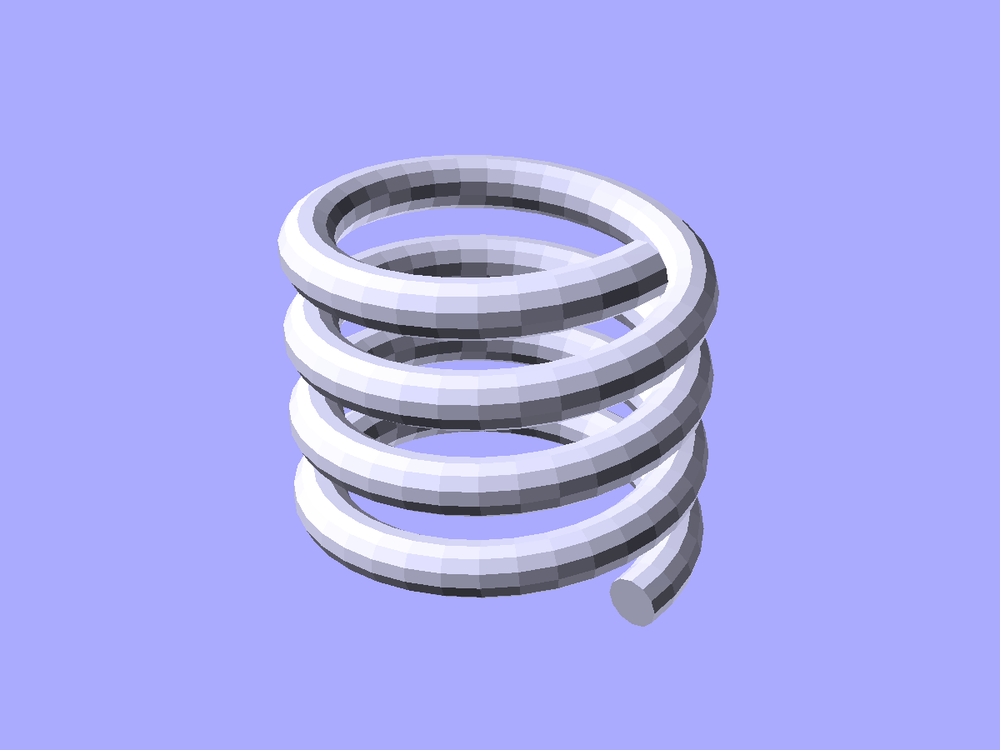
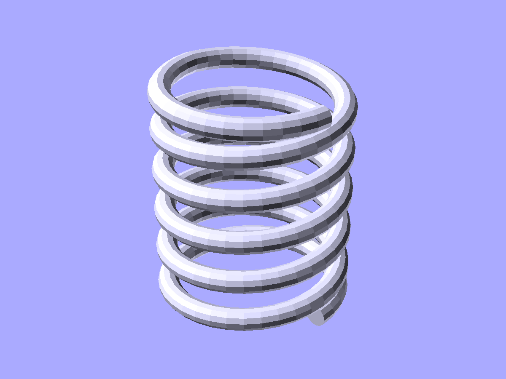
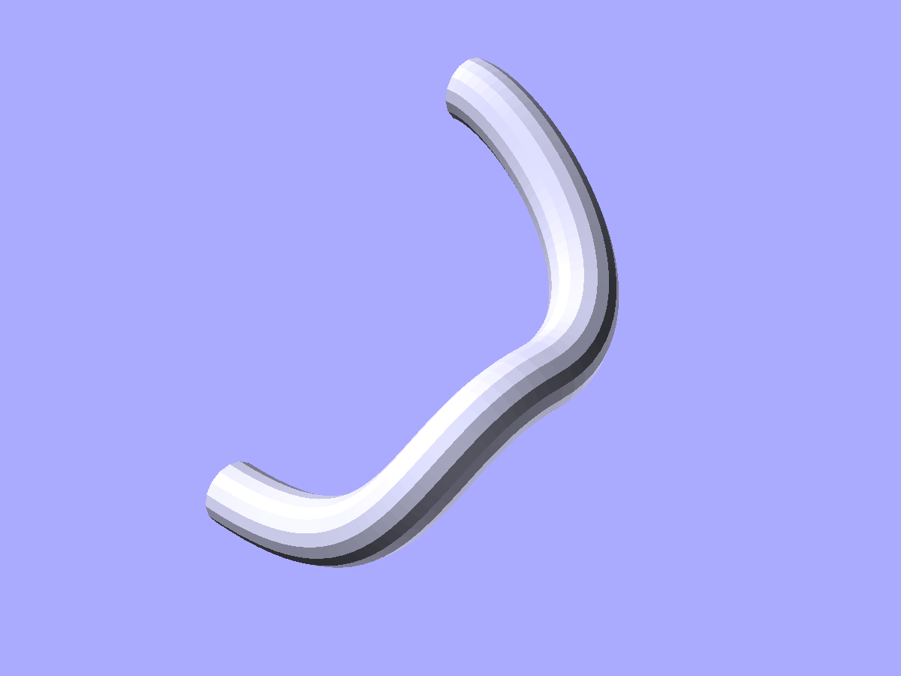

# Curves and sweep

Path generators, cross-section profiles, sweep operations, and Bezier/Catmull-Rom 2D shapes.

```python
from scadwright.shapes import (
    path_extrude, loft,
    circle_profile, square_profile, polygon_profile, rounded_rect_profile,
    resample_profile,
    helix_path, bezier_path, composite_bezier_path, catmull_rom_path, arc_path,
    bezier_2d, catmull_rom_2d,
    Helix, Spring,
)
```

## `path_extrude(profile, path)`

Sweeps a 2D cross-section along a 3D path, producing a polyhedron.

```python
profile = circle_profile(2, segments=12)
path = helix_path(r=10, pitch=5, turns=3)
shape = path_extrude(profile, path)
```

- `profile` -- list of (x, y) points describing the cross-section, counter-clockwise.
- `path` -- list of (x, y, z) points.
- `closed` -- connect last section back to first (for torus-like shapes). Default `False`.
- `convexity` -- OpenSCAD rendering hint. Default `10`.

When `closed=False`, flat end-caps are generated. The profile is oriented perpendicular to the path using rotation-minimizing frames to avoid twisting.

## `loft(sections, path)`

Sweeps *multiple* 2D cross-sections along a 3D path, producing a polyhedron whose surface interpolates between them. Where `path_extrude` uses one profile, `loft` lets each path point carry its own section — square-to-round adapters, tapered nozzles, organic transitions.

```python
sections = [
    circle_profile(5, segments=24),
    resample_profile(square_profile(8), 24),
]
path = [(0, 0, 0), (0, 0, 10)]
adapter = loft(sections, path)
```

All sections must have the same number of vertices — use `resample_profile` to bring profiles with different native point counts to a common count. Sections sit perpendicular to the path tangent (same rotation-minimizing frames as `path_extrude`), so on a curved path each section tilts to follow the path direction.

- `sections` -- list of `(x, y)` profiles, one per path point.
- `path` -- list of `(x, y, z)` positions; `len(path) == len(sections)`.
- `closed` -- connect last section back to first (ring loft). Default `False`.
- `smooth` -- when `True`, each vertex's track through the sections is smoothed with a Catmull-Rom spline sampled at `smooth_steps` sub-sections per input segment. Default `False` (ruled — straight triangle strips between adjacent sections). Works with `closed=True` (periodic Catmull-Rom; the smoothed curve wraps cleanly through the loop).
- `smooth_steps` -- sub-sections per input segment when `smooth=True`. Default `8`.
- `convexity` -- OpenSCAD rendering hint. Default `10`.

```python
# Smooth taper through three circles of different radii.
sections = [circle_profile(5, segments=16),
            circle_profile(8, segments=16),
            circle_profile(3, segments=16)]
path = [(0, 0, 0), (0, 0, 5), (0, 0, 15)]
shape = loft(sections, path, smooth=True)
```

End-caps are fan-triangulated from vertex 0 of each end section, same as `path_extrude` — sections should be convex.

## Cross-section profiles

Profile helpers return CCW-ordered `(x, y)` point lists ready to pass to `path_extrude` as the cross-section.

### `circle_profile(r, segments=16)`

```python
wire = circle_profile(1.5, segments=12)
tube_shape = path_extrude(wire, my_path)
```

### `square_profile(size, center=True)`

Four-point square cross-section. `size` accepts a scalar or `(w, h)`. `center=True` (default) centers the square on the origin; `center=False` puts the lower-left corner at the origin.

```python
square_profile(4)                    # 4×4 centered
square_profile((6, 2))               # 6 wide × 2 tall, centered
square_profile(4, center=False)      # corner at origin
```

### `polygon_profile(sides, r, rotate=0.0)`

Regular n-gon cross-section inscribed in radius `r`. First vertex on +X by default; `rotate` (in degrees) rotates the starting position CCW.

```python
polygon_profile(6, 3)                # hex profile
polygon_profile(8, 2, rotate=22.5)   # octagon, flat-side up
```

### `rounded_rect_profile(x, y, r, segments_per_corner=8)`

Rounded-rectangle cross-section, centered on the origin. `r` is the corner radius. `r=0` produces a sharp-cornered rectangle (4 points).

```python
rounded_rect_profile(20, 10, 2)      # 20 × 10, 2 mm corners
rounded_rect_profile(20, 10, 0)      # plain rectangle
```

### `almond_profile(chord_r, sag, n_arc=8)`

Almond (lens / vesica) cross-section: two circular arcs bowing out above and below a shared chord on the x-axis, meeting at a point on each end. `chord_r` is the half-chord, so the full width is `2*chord_r`; `sag` is each arc's height above the chord, so the full thickness is `2*sag`. `n_arc` sets the points per arc. Good for leaf springs, teardrop ribs, and pointed-oval wire used in a swept coil.

```python
almond_profile(3, 1)                 # 6 wide × 2 thick lens
almond_profile(3, 1, n_arc=16)       # smoother arcs
```

### `resample_profile(profile, n)`

Resample a closed 2D profile to `n` evenly-spaced points along its perimeter. Use it to align profiles of different native point counts so they can be lofted together — `loft` requires every section to have the same vertex count.

```python
sections = [
    resample_profile(circle_profile(5, segments=24), 16),
    resample_profile(square_profile(8), 16),
    resample_profile(polygon_profile(sides=6, r=4), 16),
]
shape = loft(sections, [(0, 0, 0), (0, 0, 5), (0, 0, 10)])
```

The resampled profile preserves the source's perimeter and traces its polygon edges; points are linearly interpolated along the source edges at equal arc-length intervals. The first output point coincides with the first input point.

## Path generators

Each path generator returns a list of `(x, y, z)` points.

### `helix_path(r, pitch, turns)`

Helical path centered on the z-axis, starting at (r, 0, 0) and rising in +z:

```python
path = helix_path(r=10, pitch=5, turns=3, points_per_turn=36)
```

### `bezier_path(control_points, steps=32)`

Cubic Bezier curve through 4 control points:

```python
path = bezier_path([(0,0,0), (10,0,5), (10,10,5), (0,10,0)], steps=24)
```

### `composite_bezier_path(segments, steps_per_segment=32)`

Chain of cubic Bezier segments. Each segment is 4 control points; consecutive segments must share their boundary anchor (segment N's first point equals segment N-1's last). Continuity beyond C0 is the user's responsibility — place handles to align tangents for C1.

```python
path = composite_bezier_path([
    [(0,0,0),  (5,0,0),   (5,5,0),   (10,5,0)],
    [(10,5,0), (15,5,0),  (15,10,0), (20,10,0)],
])
```

`composite_bezier_path([segment])` produces the same output as `bezier_path(segment)`.

### `catmull_rom_path(points, steps_per_segment=16, closed=False)`

Smooth curve passing through every point:

```python
path = catmull_rom_path([(0,0,0), (10,5,0), (20,0,0), (30,5,0)])
```

Pass `closed=True` for a periodic loop — the curve wraps from the last point back to the first using actual neighbor tangents (no endpoint mirroring). Closed mode requires at least 3 input points and produces `n * steps_per_segment` samples (no duplicate at the seam).

### `arc_path(center, radius, start_angle, end_angle, normal=(0,0,1), steps=32)`

Circular arc lying in the plane through `center` perpendicular to `normal`. Angles in degrees, measured CCW about `normal` from a reference direction in the plane (the projection of +X, falling back to +Y if +X is parallel to `normal`).

```python
# Quarter-circle in XY plane:
arc_path(center=(0,0,0), radius=10, start_angle=0, end_angle=90)

# Quarter-circle in YZ plane:
arc_path(center=(0,0,0), radius=10, start_angle=0, end_angle=90, normal=(1,0,0))
```

`end_angle - start_angle` is the sweep; negative values sweep clockwise.

## 2D Bezier and Catmull-Rom shapes

### `bezier_2d(segments, closed=False, steps_per_segment=32)`

Polygon traced by a chain of cubic Bezier segments in the XY plane. Same segment-list shape as `composite_bezier_path`.

When `closed=True`, the curve must form a loop: the first segment's first anchor must equal the last segment's last anchor. The duplicated point is dropped so the polygon boundary is traced entirely by the curve.

```python
# Open shape (polygon implicitly closes with a straight edge):
bezier_2d([[(0,0), (5,0), (5,5), (0,5)]])

# Closed loop (entirely curve-traced):
bezier_2d([
    [(0,0), (5,0), (5,5), (0,5)],
    [(0,5), (-5,5), (-5,0), (0,0)],
], closed=True)
```

Useful for airfoil cross-sections, organic 2D profiles, custom seal cross-sections — anything where the boundary is curved rather than polygonal.

### `catmull_rom_2d(points, closed=False, steps_per_segment=16)`

Polygon traced by a Catmull-Rom spline through `points` in the XY plane. The spline passes through every input point.

```python
# Open spline (polygon implicitly closes with a straight edge):
catmull_rom_2d([(0,0), (10,5), (20,0), (30,5)])

# Closed loop (spline wraps from last point back to first):
catmull_rom_2d([(0,0), (10,5), (20,0), (10,-5)], closed=True)
```

`closed=True` requires at least 3 points.

## Components

### `Helix`

Solid helix: a circular cross-section swept along a helical path.

```python
coil = Helix(r=10, wire_r=1, pitch=5, turns=3)
```

- `r` -- helix radius (center of wire to axis)
- `wire_r` -- wire cross-section radius
- `pitch` -- z-rise per full turn
- `turns` -- number of turns



*`Helix(r=10, wire_r=1.5, pitch=5, turns=4)` — a solid coil rising along z.*

### `Spring`

Compression spring with optional flat ends for stable resting.

```python
s = Spring(r=8, wire_r=0.5, pitch=3, turns=5)
s = Spring(r=8, wire_r=0.5, pitch=3, turns=5, flat_ends=False)
```

- Same params as `Helix`, plus `flat_ends` (default `True`).
- Flat ends add half-turn at zero pitch at each end so the spring sits flat.



*`Spring(r=8, wire_r=1, pitch=4, turns=5)` — a compression spring with flat end turns for stable resting.*

## Worked example: swept hose

A piece of curved tubing that bends in two directions, built from a circular cross-section swept along a two-segment composite Bezier path:

```python
from scadwright.shapes import (
    path_extrude, circle_profile, composite_bezier_path,
)

hose = path_extrude(
    circle_profile(2, segments=16),
    composite_bezier_path([
        [(0, 0, 0),   (15, 0, 0),   (15, 0, 10),  (15, 10, 10)],
        [(15, 10, 10), (15, 20, 10), (5, 20, 20),  (0, 20, 20)],
    ]),
)
```



*A two-segment Bezier path, swept with a circular profile.*

## See also

- [Curve transforms](transforms.md) — `.along_curve()`, `.bend()`, `.twist_copy()` chained methods that distribute, wrap, or stack copies along path-like rules.
- [Extrusions](../extrusions.md) — `linear_extrude` and `rotate_extrude` for the simpler axis-aligned and revolution cases.
