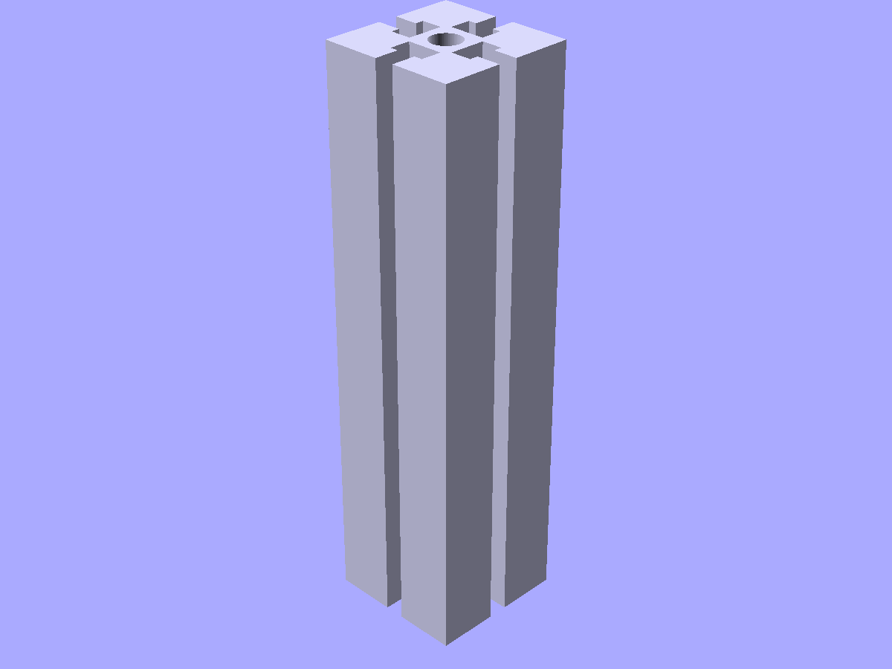

# Ecosystem components

Gridfinity storage system and aluminum extrusion profiles.

```python
from scadwright.shapes import GridfinityBase, GridfinityBin, ExtrusionProfile
```

## Gridfinity

### `GridfinityBase(grid_x, grid_y)`

Gridfinity-compatible baseplate with magnet and screw holes at standard positions.

```python
GridfinityBase(grid_x=3, grid_y=2)     # 3x2 grid (126x84mm)
```

Publishes `outer_w`, `outer_l`. Standard 42mm grid unit.


*`GridfinityBase(grid_x=3, grid_y=2)` — a 3×2 baseplate with standard magnet and screw pockets.*

### `GridfinityBin(grid_x, grid_y, height_units)`

Storage bin that sits on a GridfinityBase. Height in 7mm increments.

```python
GridfinityBin(grid_x=1, grid_y=1, height_units=3)           # single cell, 21mm tall
GridfinityBin(grid_x=2, grid_y=1, height_units=5, dividers_x=2)  # split into 2 compartments
```

Publishes `outer_w`, `outer_l`, `total_h`.


*`GridfinityBin(grid_x=2, grid_y=1, height_units=4)` — a 2×1 bin that drops onto the base.*

## `ExtrusionProfile(size)` (2D)

T-slot aluminum extrusion cross-section (2020/2040 style). Extrude for a 3D rail.

```python
ExtrusionProfile(size=20).linear_extrude(height=200)    # 2020 rail
ExtrusionProfile(size=40, slots=2).linear_extrude(height=300)  # 2040 rail
```

`slots` controls T-slot channels per face (default 1).



*`ExtrusionProfile(size=20).linear_extrude(height=80)` — 2020-style aluminum rail cross-section.*
