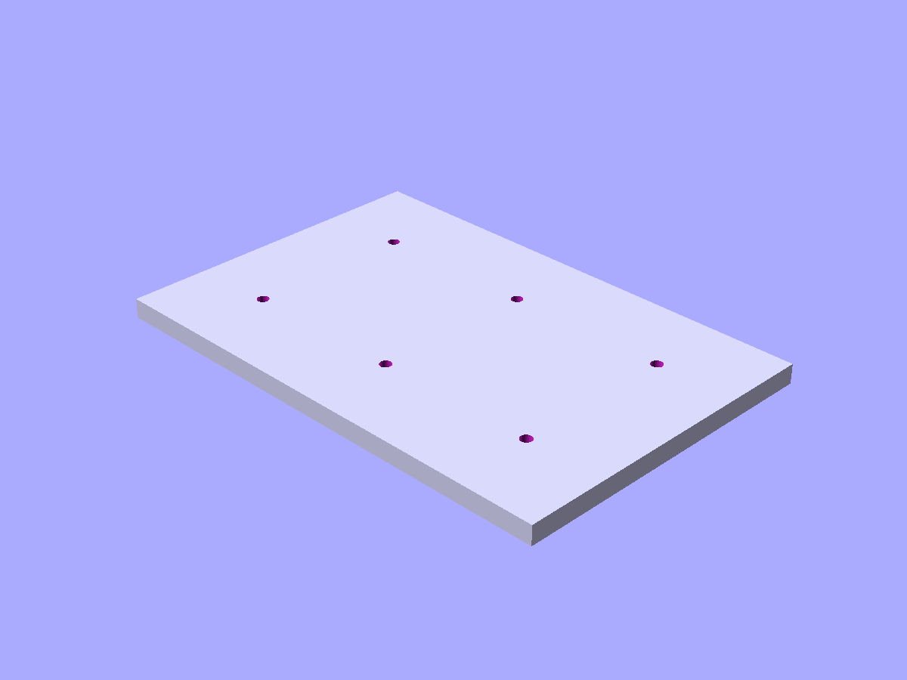
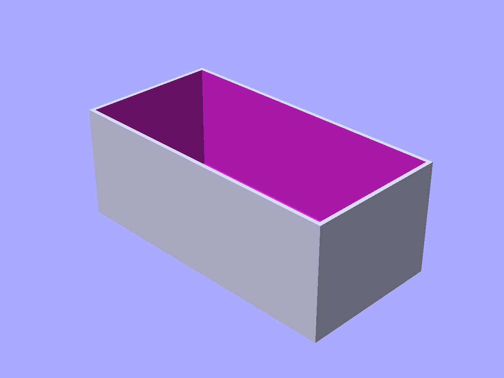

# Ecosystem components

Gridfinity storage system.

```python
from scadwright.shapes import GridfinityBase, GridfinityBin
```

## Gridfinity

### `GridfinityBase(grid_x, grid_y)`

Gridfinity-compatible baseplate with magnet and screw holes at standard positions.

```python
GridfinityBase(grid_x=3, grid_y=2)     # 3x2 grid (126x84mm)
```

You can read `outer_w` and `outer_l` off the instance. Standard 42mm grid unit.



*`GridfinityBase(grid_x=3, grid_y=2)` — a 3×2 baseplate with standard magnet and screw pockets.*

### `GridfinityBin(grid_x, grid_y, height_units)`

Storage bin that sits on a GridfinityBase. Height in 7mm increments.

```python
GridfinityBin(grid_x=1, grid_y=1, height_units=3)           # single cell, 21mm tall
GridfinityBin(grid_x=2, grid_y=1, height_units=5, dividers_x=2)  # split into 2 compartments
```

You can read `outer_w`, `outer_l`, and `total_h` off the instance.



*`GridfinityBin(grid_x=2, grid_y=1, height_units=4)` — a 2×1 bin that drops onto the base.*

### Customizing the spec

Geometry is driven by a `GridfinitySpec` namedtuple — grid unit, wall thickness, magnet/screw sizes, etc. The default `STANDARD_GRIDFINITY` matches the standard 42mm system. Override `spec` to produce half-scale, double-wall, or any other non-standard variant:

```python
from scadwright.shapes import GridfinitySpec, STANDARD_GRIDFINITY, GridfinityBase

HALF_SCALE = STANDARD_GRIDFINITY._replace(grid_unit=21.0, magnet_d=3.0, magnet_h=1.2)
base = GridfinityBase(grid_x=4, grid_y=3, spec=HALF_SCALE)
```
