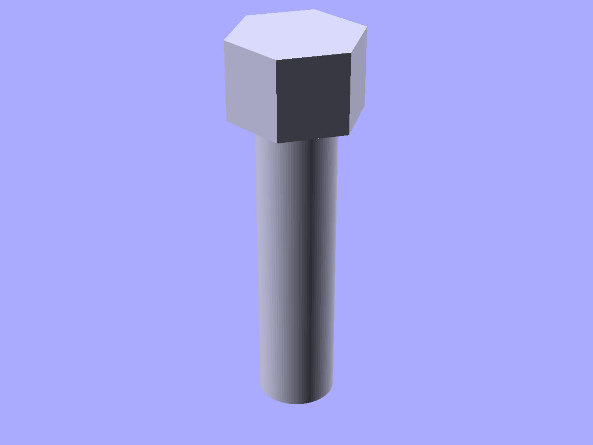
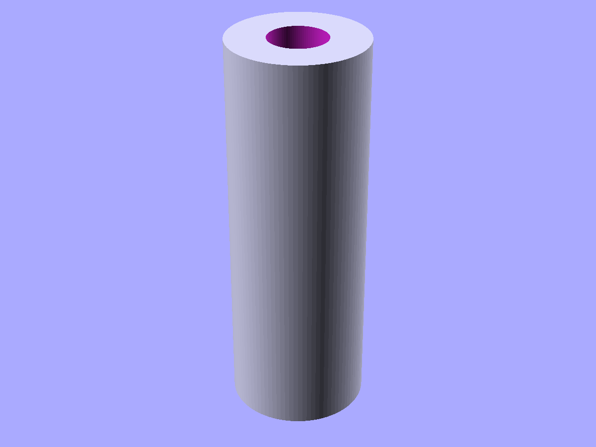

# Fasteners and hardware

ISO metric bolts, nuts, clearance/tap holes, heat-set insert pockets, captive nut pockets, and standoffs.

```python
from scadwright.shapes import (
    Bolt, HexNut, SquareNut,
    Standoff, HeatSetPocket, CaptiveNutPocket,
    NutSpec, InsertSpec, ScrewSpec,
    clearance_hole, tap_hole,
)
```

Spec-driven Components (`HexNut`, `SquareNut`, `HeatSetPocket`, `CaptiveNutPocket`) take a typed spec namedtuple. Use the `Cls.of("M3")` classmethod for canned ISO sizes:

```python
HexNut.of("M3")                          # canned ISO size
HexNut(spec=NutSpec(d=4, af=7, h=3))     # custom dimensions
```

## `Bolt(size, length)`

ISO metric bolt with head and smooth shaft. The bolt stands upright with the head at the top and shaft extending downward from z=0.

```python
Bolt(size="M3", length=10)                       # socket head (default)
Bolt(size="M5", length=20, head="button")        # button head
```

Sizes: M2, M2.5, M3, M4, M5, M6, M8, M10, M12. Head styles: `"socket"` (ISO 4762), `"button"` (ISO 7380).



*`Bolt(size="M5", length=20)` — head at the top, smooth shaft extending down.*

## `HexNut.of(size)` / `SquareNut.of(size)`

ISO metric nuts centered on the origin. Both publish `af` (across-flats), `h` (height), `d` (bore) as instance attributes.

```python
HexNut.of("M3")                          # canned
SquareNut.of("M4")
HexNut(spec=NutSpec(d=4, af=7, h=3))     # custom
```

## `clearance_hole(size, depth)` / `tap_hole(size, depth)`

Factory functions returning a cylinder sized for through-hole or tapped-hole drilling. Use `.through(parent)` for clean cuts.

```python
part = difference(plate, clearance_hole("M3", depth=10).through(plate))
```

## `Standoff(od, id, h)`

Hollow screw-mount column. Publishes a `mount_top` anchor at the top.

```python
post = Standoff(od=7, id=3, h=8)
pcb = cube([50, 30, 1.6]).attach(post, face="mount_top")
```



*`Standoff(od=7, id=3, h=20)` — hollow column with a through-hole for a mounting screw.*

## `HeatSetPocket.of(size)`

Pocket sized for a brass heat-set insert. Subtract from a parent. Publishes `hole_d` and `hole_depth` for downstream sizing.

```python
pocket = HeatSetPocket.of("M3")
part = difference(boss, pocket.through(boss))

# Or with a custom spec:
pocket = HeatSetPocket(spec=InsertSpec(d=3, od=4, h=4, hole_d=3.8, hole_depth=4.5))
```

Sizes: M2, M3, M4, M5.

## `CaptiveNutPocket.of(size, depth)`

Hex pocket with insertion channel for a captive nut. `channel_axis` controls the slot direction. Publishes `af` (across-flats).

```python
pocket = CaptiveNutPocket.of("M3", depth=3)
pocket = CaptiveNutPocket.of("M3", depth=3, channel_axis="y")
pocket = CaptiveNutPocket(spec=NutSpec(d=3, af=5.5, h=2.4), depth=3)
```

## Data tables

The raw dimension data is available for custom Components:

```python
from scadwright.shapes import get_screw_spec, get_nut_spec, get_insert_spec

spec = get_screw_spec("M3", head="socket")
spec.d          # 3.0
spec.head_d     # 5.5
spec.clearance_d  # 3.4
spec.tap_d      # 2.5
```

### See also

- [Fillets and chamfers](fillets.md) -- Countersink and Counterbore hole profiles for screw heads
- [Mechanical components](mechanical.md) -- bearings and pulleys for shaft assemblies
