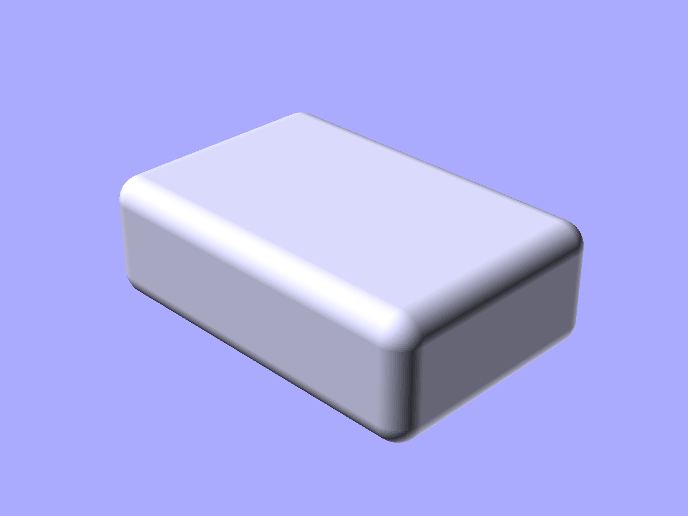
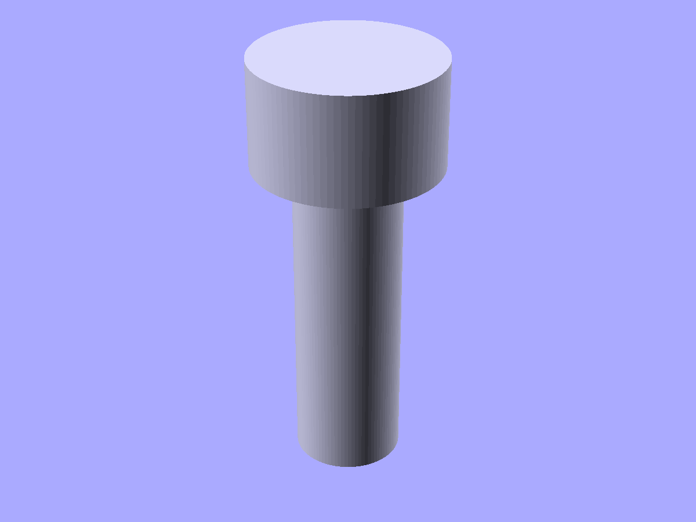

# Fillets, chamfers, and hole profiles

Edge-rounding, edge-beveling, and screw-hole profiles.

```python
from scadwright.shapes import (
    ChamferedBox, FilletMask, ChamferMask,
    Countersink, Counterbore,
)
```

## `ChamferedBox(size, fillet= or chamfer=)`

Box with all edges rounded or beveled. Centered on the origin. Specify exactly one of `fillet` or `chamfer`.

```python
ChamferedBox(size=(30, 20, 10), fillet=2)     # rounded edges
ChamferedBox(size=(30, 20, 10), chamfer=2)    # 45-degree bevels
```



*`ChamferedBox(size=(30, 20, 10), fillet=2)` — box with every edge rolled to a 2 mm radius.*

## `FilletMask(r, length, axis="z")`

Subtractable concave fillet mask. Place at an edge and subtract to round it.

```python
mask = FilletMask(r=3, length=20)
part = difference(box, mask.translate([box_x, box_y, 0]))
```

`axis` is the edge direction: `"x"`, `"y"`, or `"z"`.

## `ChamferMask(size, length, axis="z")`

Subtractable 45-degree chamfer mask. Same usage as FilletMask.

```python
mask = ChamferMask(size=2, length=20, axis="z")
part = difference(box, mask)
```

## `Countersink(shaft_d, head_d, head_depth, shaft_depth)`

Conical countersink profile for flat-head screws. Shaft at z=0, cone on top. Use `.through(parent)` for clean cuts.

```python
hole = Countersink(shaft_d=3.2, head_d=6.3, head_depth=1.8, shaft_depth=10)
part = difference(plate, hole.through(plate))
```

## `Counterbore(shaft_d, head_d, head_depth, shaft_depth)`

Stepped cylinder for socket-head screws. Shaft at z=0, wider bore on top.

```python
hole = Counterbore(shaft_d=3.2, head_d=5.5, head_depth=3, shaft_depth=10)
part = difference(plate, hole.through(plate))
```



*`Counterbore(shaft_d=4, head_d=7, head_depth=4, shaft_depth=12)` — the solid mask; subtract it from a part for a socket-head pocket.*

## `counterbore_for_screw(size, shaft_depth, head="socket")` and `countersink_for_screw(...)`

Factories that build a `Counterbore` / `Countersink` sized for a standard ISO metric screw. Pulls `clearance_d`, `head_d`, and `head_h` from the [ScrewSpec](fasteners.md) for the given size.

```python
from scadwright.shapes import counterbore_for_screw, countersink_for_screw

pocket = counterbore_for_screw("M3", shaft_depth=10)
sink = countersink_for_screw("M5", shaft_depth=20, head="button")
part = difference(plate, pocket.through(plate))
```

## `FilletRing(id, od, base_angle)`

Right-triangle-cross-section ring for flange fillets. `slant="outwards"` (default) slopes the outer wall; `"inwards"` slopes the inner wall.

```python
FilletRing(id=10, od=20, base_angle=30)
FilletRing(id=10, od=20, base_angle=30, slant="inwards")
```

Both variants have the same height and slope for matched (id, od, base_angle), so they mate when one part's outer fillet meets another's inner fillet.

### See also

- [Fasteners](fasteners.md) -- bolts and nuts (Countersink/Counterbore pair with clearance holes for screw assemblies)
