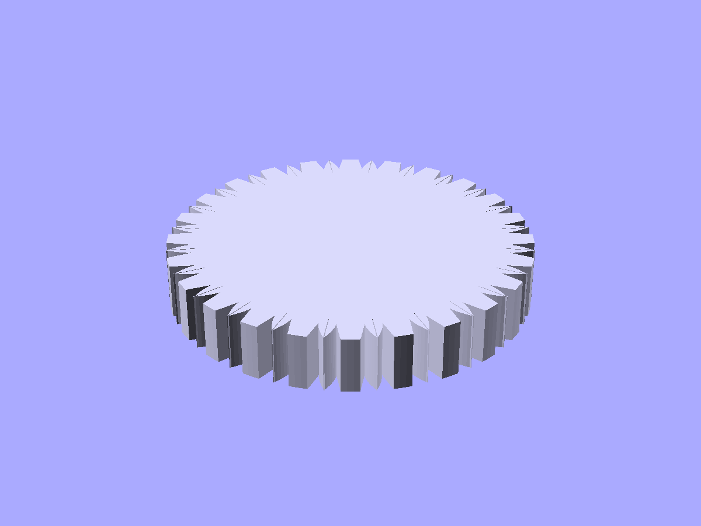
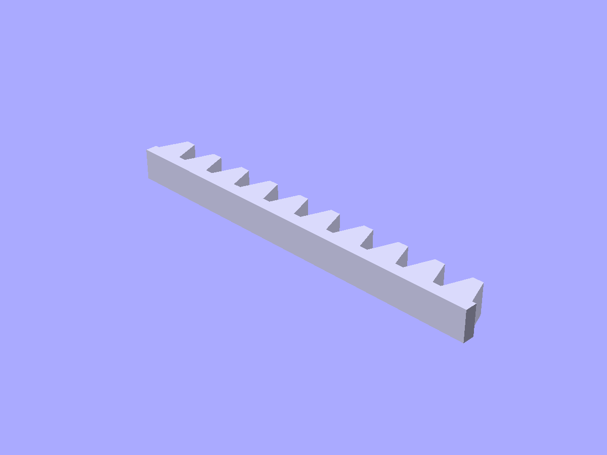
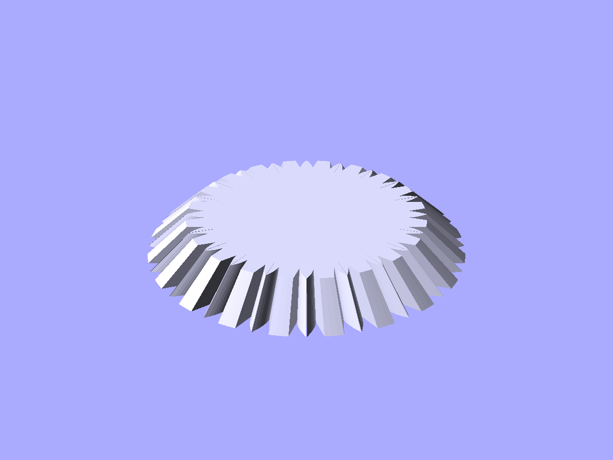

# Gears and motion

Involute spur gears, ring gears, racks, bevel gears, worms and worm gears.

```python
from scadwright.shapes import (
    SpurGear, RingGear, Rack, BevelGear,
    Worm, WormGear,
    gear_dimensions,
)
```

All gears use standard involute tooth profiles. Meshing gears must share the same `module` and `pressure_angle`.

## `SpurGear(module, teeth, h)`

Standard involute spur gear centered on the origin, bore along z.

```python
SpurGear(module=2, teeth=20, h=5)
SpurGear(module=2, teeth=20, h=5, helix_angle=15)   # helical
```

Published attributes: `pitch_r`, `outer_r`, `root_r`, `base_r`.

For herringbone gears, build two helical gears with opposite helix angles and union them.



*`SpurGear(module=1.5, teeth=24, h=6)` — standard involute teeth around a central bore.*

## `RingGear(module, teeth, h, rim_thk)`

Internal gear: teeth on the inside of a ring. Meshes with a SpurGear of the same module.

```python
RingGear(module=2, teeth=40, h=5, rim_thk=3)
```

## `Rack(module, teeth, length, h)`

Linear gear that meshes with a spur gear. Extends along the x-axis, teeth pointing up.

```python
Rack(module=2, teeth=10, length=63, h=5)
```



*`Rack(module=2, teeth=10, length=63, h=5)` — linear gear meshing with a spur gear of the same module.*

## `BevelGear(module, teeth, h)`

Conical gear (Tredgold's approximation). For a 90-degree pair, use `cone_angle=45` on both gears.

```python
BevelGear(module=2, teeth=20, h=5, cone_angle=45)
```



*`BevelGear(module=2, teeth=20, h=5, cone_angle=45)` — conical gear for right-angle pairs.*

## `Worm(module, length, shaft_r)` / `WormGear(module, teeth, h)`

Worm drive pair. The worm is a helical thread on a shaft; the worm gear is a spur-like wheel.

```python
w = Worm(module=2, length=20, shaft_r=5)
wg = WormGear(module=2, teeth=30, h=5)
```

`leads` on Worm controls the number of thread starts (default 1).

## `gear_dimensions(module, teeth, pressure_angle=20)`

Utility function returning `(pitch_r, base_r, outer_r, root_r)` for any gear specification. Useful for computing center distances and clearances.

```python
pitch_r, base_r, outer_r, root_r = gear_dimensions(module=2, teeth=20)
center_distance = pitch_r + gear_dimensions(2, 40)[0]  # meshing pair
```

### See also

- [Mechanical components](mechanical.md) -- bearings and pulleys for mounting gears on shafts
- [Fasteners](fasteners.md) -- bolts and standoffs for gear assemblies
