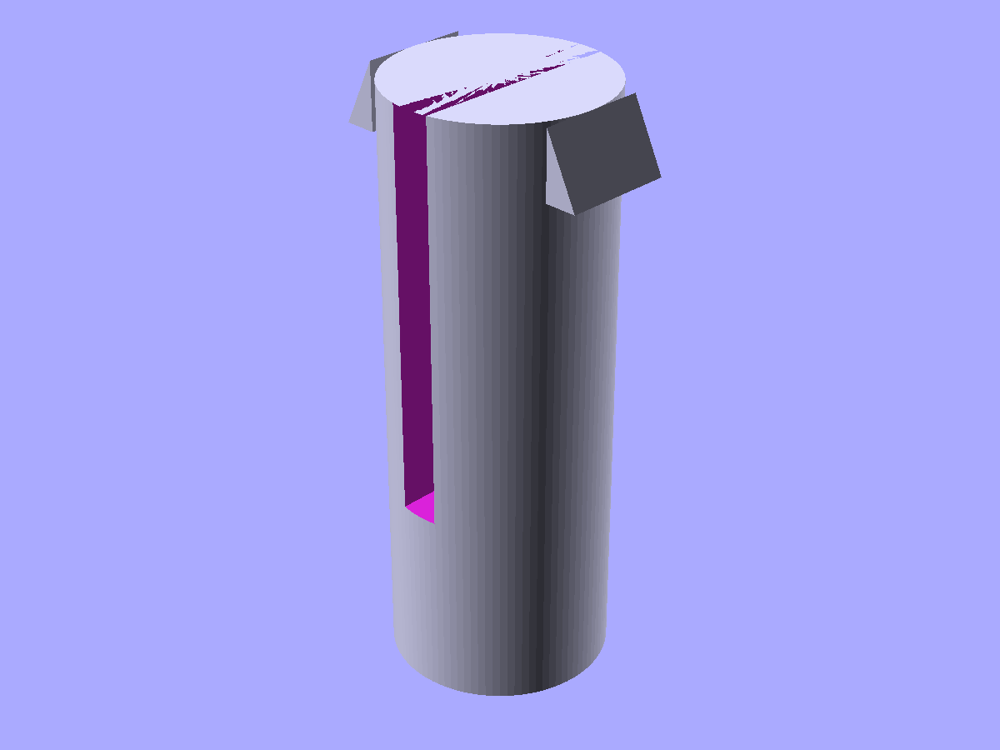
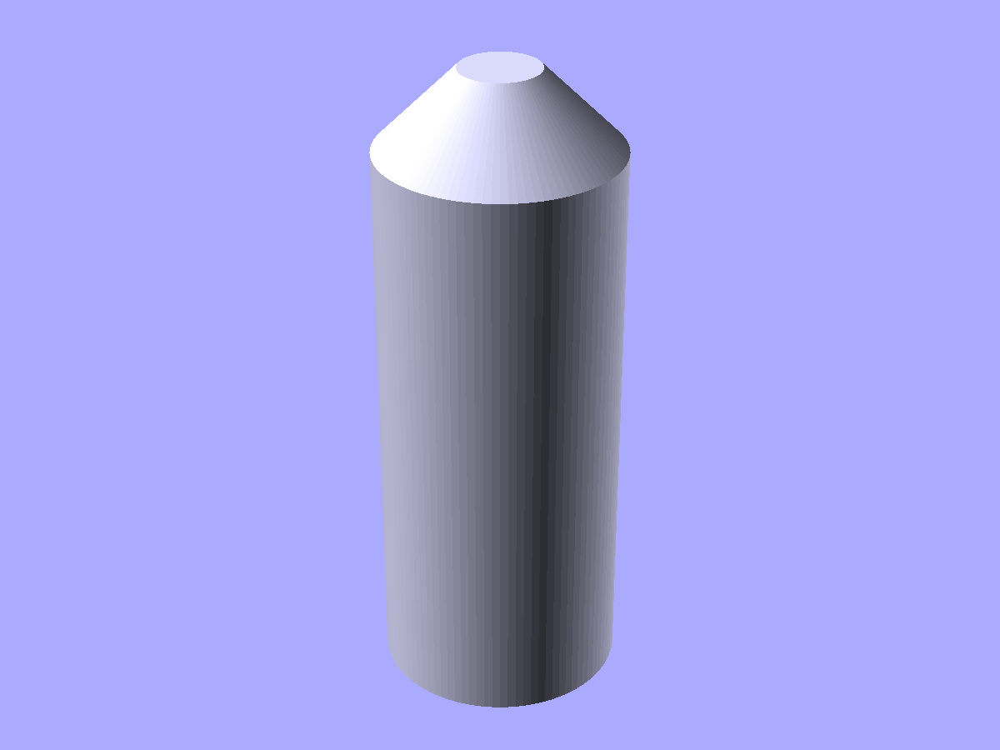
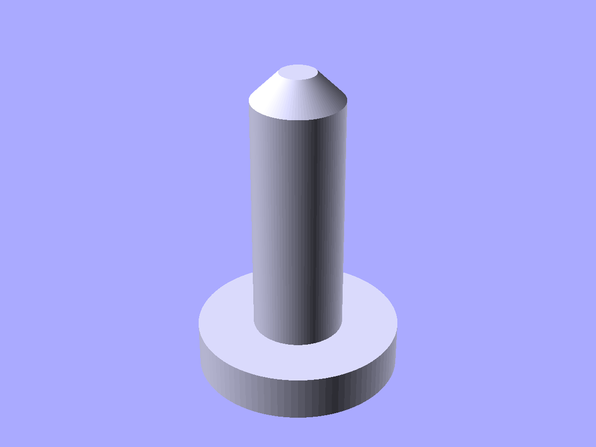

# Joints

Parametric joints for press-fits, snap-fits, finger joints, and alignment. Each pair-Component has a `.socket` or `.slot` property that returns a cutter sized for the matching recess — subtract it from the mating part.

```python
from scadwright.shapes import (
    TabSlot, GripTab,
    SnapHook, SnapPin,
    AlignmentPin, PressFitPeg,
)
```

## Clearances

`TabSlot`, `SnapPin`, `AlignmentPin`, and `PressFitPeg` take a `clearance` parameter that controls fit tolerance. If omitted, `clearance` resolves through the project's clearance chain — see [Clearances](../clearances.md) for project-wide configuration. Examples below show the minimal signature (no explicit clearance); pass `clearance=X` to override for a specific joint.

## Finger joints

### `TabSlot(tab_w, tab_h, tab_d)`

Finger joint tab. The Component emits the tab (positive); read `.slot` for the matching pocket cutter (sized to tab + clearance). You can also read `slot_w`, `slot_h`, `slot_d` off the instance if you need the raw dimensions. `clearance` resolves from the project's `finger` category unless passed explicitly.

```python
tab = TabSlot(tab_w=5, tab_h=3, tab_d=10)
wall = difference(wall, tab.slot.translate([x, y, z]).through(wall))
```

### `GripTab(tab_w, tab_h, tab_d, taper)`

Press-fit tab for joining separately-printed parts. `taper` widens the base for grip.

```python
GripTab(tab_w=6, tab_h=4, tab_d=8, taper=0.5)
```

## Snap joints

### `SnapHook(arm_length, hook_depth, hook_height, thk, width)`

Cantilever snap-fit hook. A triangular barb at the top of the arm has a flat catch (bottom) and a slanted ramp (top). Typical ramp is 45° (`hook_height == hook_depth`).

```python
SnapHook(arm_length=10, hook_depth=2, hook_height=2, thk=1.5, width=5)
```


*`SnapHook(arm_length=12, hook_depth=2, hook_height=2, thk=1.5, width=5)` — cantilever with a ramped barb; the arm flexes on insertion, the catch grips a ledge.*

### `SnapPin(d, h, slot_width, slot_depth, barb_depth, barb_height)`

Split-tined compliant pin. A cylindrical pin with a vertical slot cut through its tip, dividing the top portion into two flexible tines. Each tine carries an outward barb near the top; the barbs compress inward during insertion through a matching hole, then spring back to retain the pin on the far side. `socket_d` (= `d + 2*clearance`) is readable on the instance, and `.socket` is a @property returning the through-hole cutter. `clearance` resolves from the project's `snap` category (default 0.2 mm) unless passed explicitly.

```python
pin = SnapPin(d=5, h=15, slot_width=1, slot_depth=10, barb_depth=0.8, barb_height=1.5)
sheet = difference(sheet, pin.socket.translate([x, y, 0]).through(sheet))
```



*`SnapPin(d=5, h=15, slot_width=1, slot_depth=10, barb_depth=0.8, barb_height=1.5)` — tines flex inward under insertion load, barbs snap out to retain.*

## Locators

### `AlignmentPin(d, h, lead_in)`

Cylindrical pin with a tapered lead-in tip. For location only (not load-bearing): used in pairs at well-defined positions to constrain two parts' relative orientation while other features (screws, clips) provide retention. `socket_d` (= `d + 2*clearance`) is readable on the instance, and `.socket` is a @property returning the matching blind-hole cutter. `clearance` resolves from the project's `sliding` category (default 0.1 mm) unless passed explicitly.

```python
pin = AlignmentPin(d=4, h=8, lead_in=1)
mating_part = difference(mating_part, pin.socket.translate([x, y, 0]))
```



*`AlignmentPin(d=4, h=8, lead_in=1)` — locator with a tapered tip for easy engagement.*

### `PressFitPeg(shaft_d, shaft_h, flange_d, flange_h, lead_in)`

Flanged press-fit peg. A shaft with a broader flange at its base and a tapered lead-in at its tip. The flange seats against one sheet; the shaft passes through a matching hole in the opposing sheet and holds by friction.

Here, `clearance` carries the opposite sign: the socket is *smaller* than the shaft by `2 * clearance` (the shaft's oversize gives the press fit). The name stays `clearance` so the resolution machinery works uniformly across all joints; the sign convention lives in the `socket_d = shaft_d - 2 * clearance` equation. `clearance` resolves from the project's `press` category (default 0.1 mm) unless passed explicitly.

```python
peg = PressFitPeg(shaft_d=3, shaft_h=6, flange_d=6, flange_h=1.5, lead_in=0.5)
mating_sheet = difference(mating_sheet, peg.socket.translate([x, y, 0]).through(mating_sheet))
```



*`PressFitPeg(shaft_d=3, shaft_h=6, flange_d=6, flange_h=1.5, lead_in=0.5)` — flange seats on one sheet, shaft presses through the other.*

### See also

- [Fillets and chamfers](fillets.md) — `Counterbore` / `Countersink` for screw-based joints
- [Fasteners](fasteners.md) — clearance/tap holes and heat-set pockets for screw assemblies
- [Print-oriented shapes](print.md) — print aids (`PolyHole` for drilled-fit holes), infill panels, text
