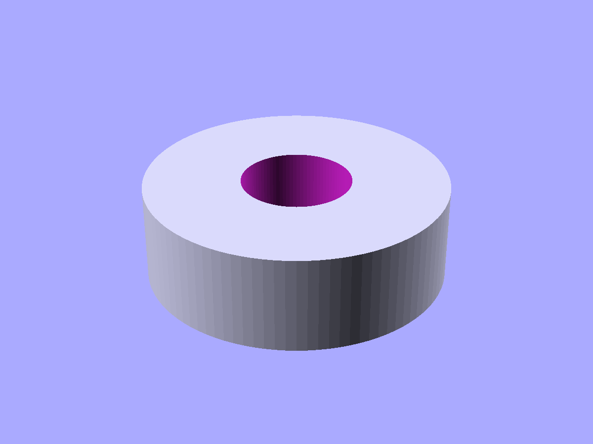
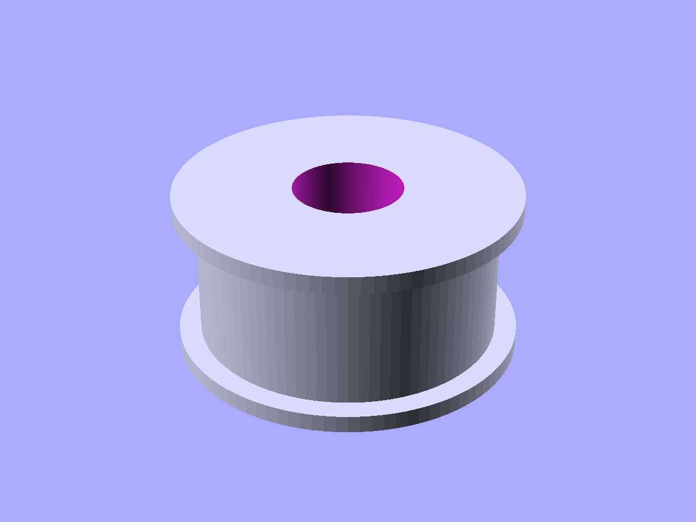
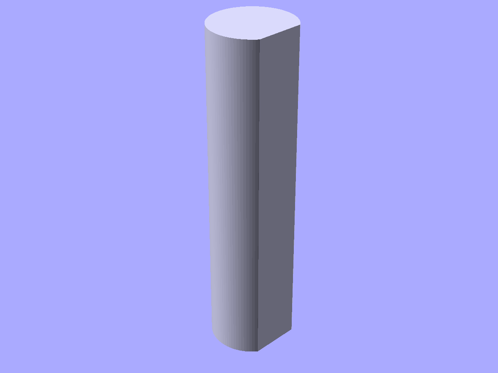
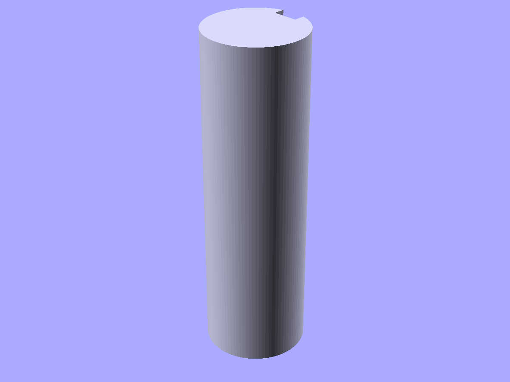

# Mechanical components

Bearings, timing pulleys, and shaft profiles.

```python
from scadwright.shapes import (
    Bearing, GT2Pulley, HTDPulley,
    DShaft, KeyedShaft,
)
```

## `Bearing.of(series)` or `Bearing(spec=)`

Ball bearing dummy for fit-check and visualization. Use the `.of("608")` classmethod for canned 6xx-series sizes, or pass a `BearingSpec` for custom dimensions.

```python
from scadwright.shapes import Bearing, BearingSpec

Bearing.of("608")                                     # 8x22x7mm
Bearing.of("625")                                     # 5x16x5mm
Bearing(spec=BearingSpec(id=10, od=30, width=9))      # custom
```

Publishes `id`, `od`, `width`. Available series: 604-609, 623-626, 6000-6005, 6200-6205.



*`Bearing.of("608")` — 608-series ball bearing (8×22×7 mm).*

## `GT2Pulley(teeth, bore_d, belt_width)`

GT2 timing belt pulley (2mm pitch) with flanges and bore.

```python
GT2Pulley(teeth=20, bore_d=5, belt_width=6)
```

Publishes `pitch_d`, `od`.



*`GT2Pulley(teeth=20, bore_d=5, belt_width=6)` — 2mm-pitch timing belt pulley with flanges.*

## `HTDPulley(teeth, bore_d, belt_width, pitch)`

HTD timing belt pulley. Specify `pitch` (e.g. 5 for HTD-5M).

```python
HTDPulley(teeth=20, bore_d=8, belt_width=15, pitch=5)
```

## `DShaft(d, flat_depth)` (2D)

D-shaped shaft cross-section. Extrude for a 3D shaft.

```python
DShaft(d=5, flat_depth=0.5).linear_extrude(height=20)
```



*`DShaft(d=10, flat_depth=1.0).linear_extrude(height=40)` — motor shaft profile with a flat for a set-screw grip.*

## `KeyedShaft(d, key_w, key_h)` (2D)

Shaft cross-section with a rectangular keyway. Extrude for 3D.

```python
KeyedShaft(d=10, key_w=3, key_h=1.5).linear_extrude(height=30)
```



*`KeyedShaft(d=12, key_w=3, key_h=1.5).linear_extrude(height=40)` — shaft with a rectangular keyway.*

### See also

- [Gears](gears.md) -- spur gears, racks, and worm drives to mount on shafts
- [Fasteners](fasteners.md) -- bolts and standoffs for mounting
