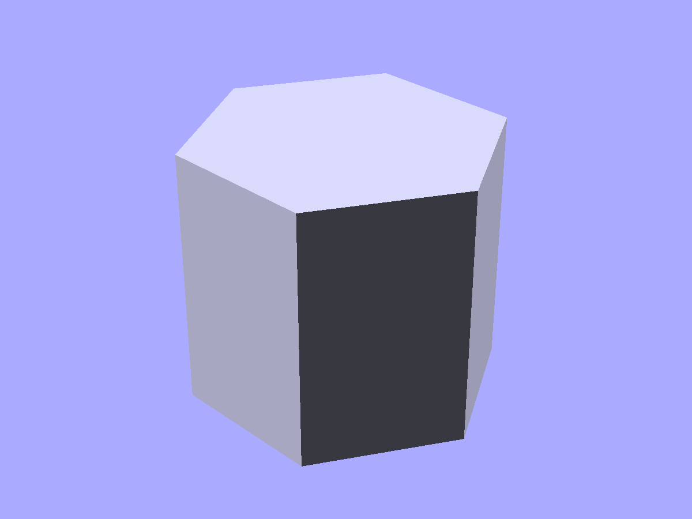
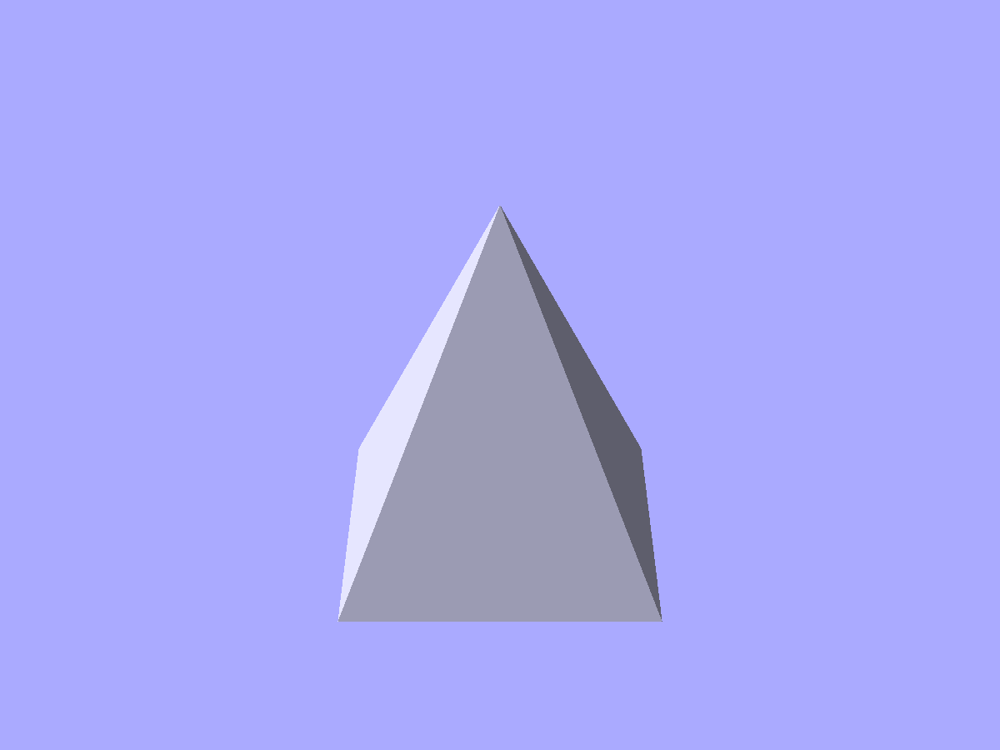
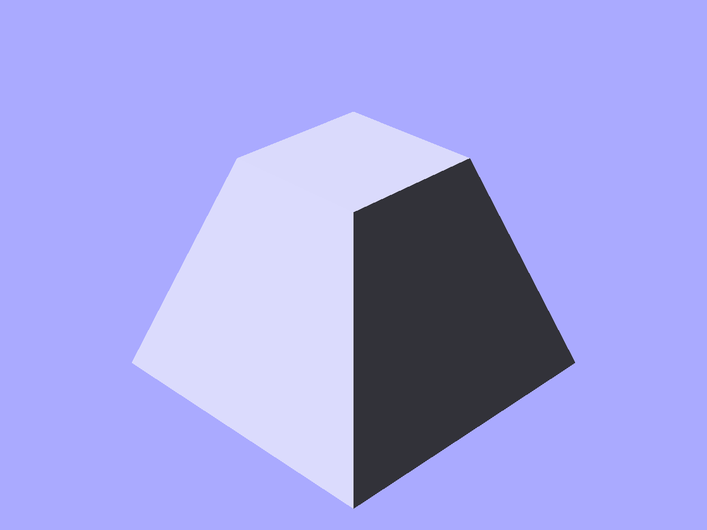
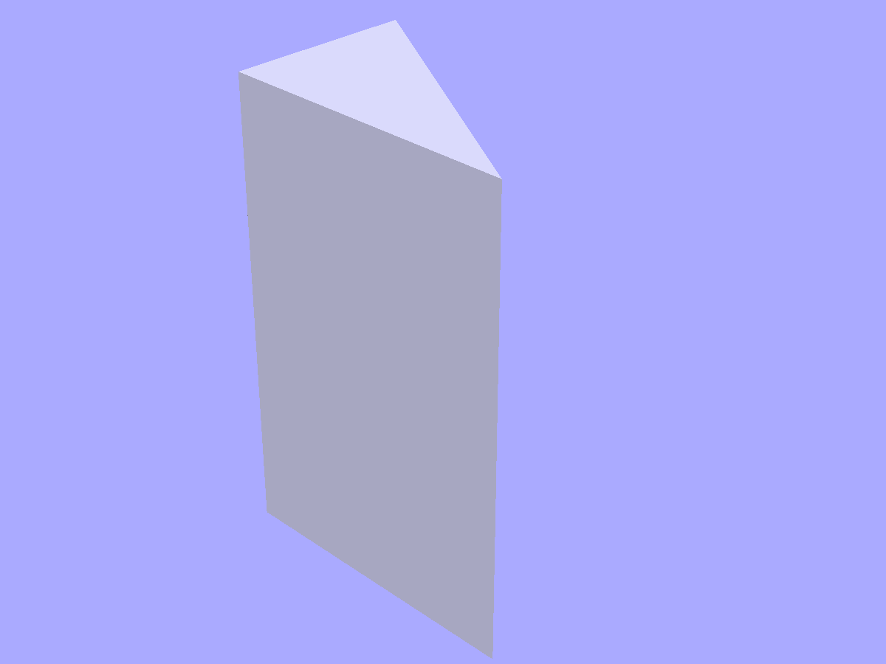
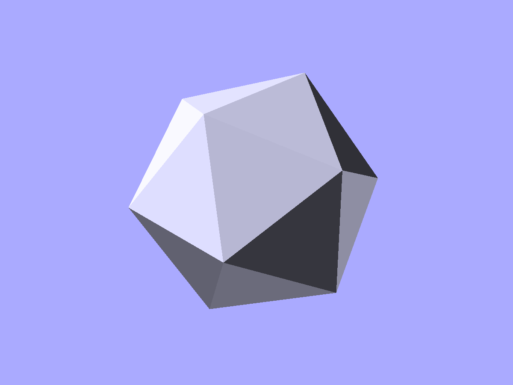
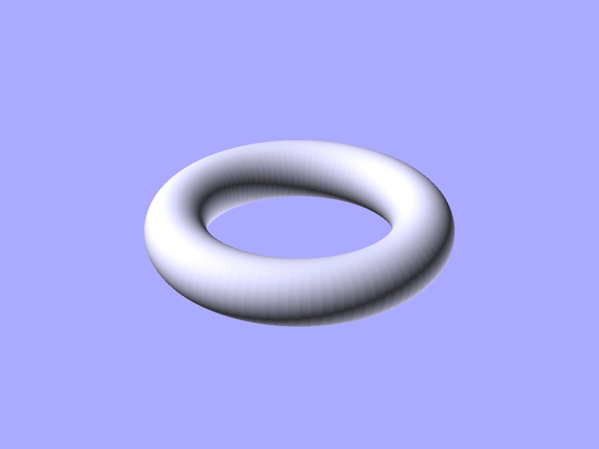
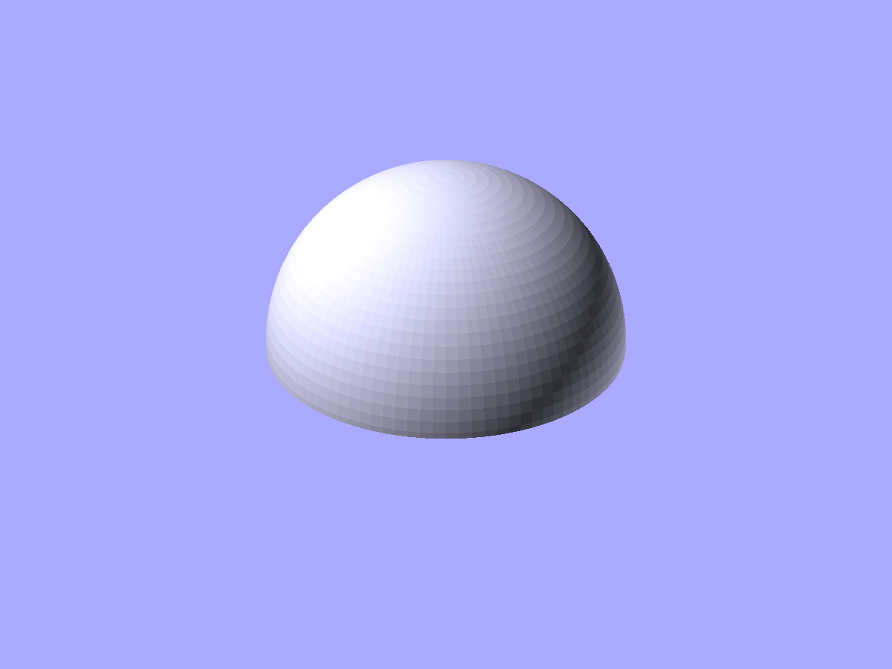
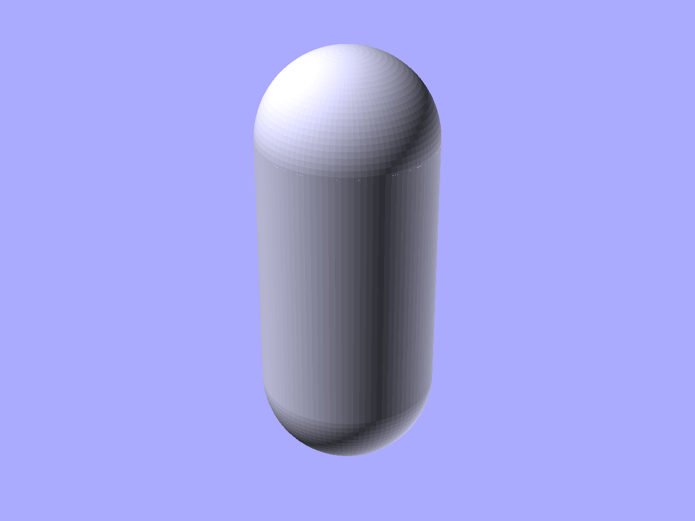
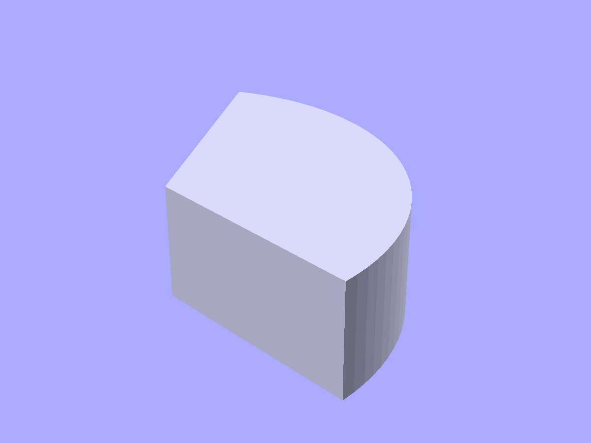

# Polyhedra and basic 3D shapes

Prisms, pyramids, Platonic solids, torus, dome, and spherical cap.

```python
from scadwright.shapes import (
    Prism, Pyramid, Prismoid, Wedge,
    Tetrahedron, Octahedron, Dodecahedron, Icosahedron,
    Torus, Dome, SphericalCap, Capsule, PieSlice,
)
```

## `Prism(sides, r, h)`

N-sided prism centered on the origin, base on z=0. Pass `top_r` for a frustum (tapered prism).

```python
Prism(sides=6, r=10, h=20)              # hexagonal prism
Prism(sides=4, r=10, h=15, top_r=5)     # square frustum
```



*`Prism(sides=6, r=12, h=20)` — a hexagonal column.*

## `Pyramid(sides, r, h)`

N-sided pyramid with apex at (0, 0, h), base on z=0.

```python
Pyramid(sides=4, r=10, h=20)            # square pyramid
Pyramid(sides=3, r=8, h=12)             # triangular
```



*`Pyramid(sides=4, r=12, h=20)` — a square pyramid with apex above the origin.*

## `Prismoid(bot_w, bot_d, top_w, top_d, h, shift=(0, 0))`

Rectangular frustum: a rectangle `bot_w` × `bot_d` on z=0 tapering to `top_w` × `top_d` at z=`h`. `shift=(dx, dy)` offsets the top face relative to the base center — useful for transition parts. For a pointed apex (rectangular pyramid), use `Pyramid` with `sides=4`.

```python
Prismoid(bot_w=20, bot_d=20, top_w=10, top_d=10, h=15)
Prismoid(bot_w=20, bot_d=20, top_w=10, top_d=10, h=15, shift=(5, 0))
```



*`Prismoid(bot_w=20, bot_d=20, top_w=10, top_d=10, h=15)` — a truncated square pyramid.*

## `Wedge(base_w, base_h, thk, fillet=0)`

Right-triangular prism. Cross-section is a right triangle with legs along +x (`base_w`) and +y (`base_h`), extruded `thk` along +z; the right-angle vertex sits at the origin. Doubles as the library's rib / gusset shape. `fillet` (default 0) softens all three corners; note that rounding an acute corner shrinks the envelope by more than the fillet radius, so shallow triangles shrink noticeably.

```python
Wedge(base_w=10, base_h=6, thk=20)              # bare ramp / gusset
Wedge(base_w=10, base_h=6, thk=20, fillet=1)    # rounded corners
```



*`Wedge(base_w=10, base_h=6, thk=20)` — triangular-prism ramp or rib.*

## Platonic solids

All inscribed in a sphere of radius `r`, centered on the origin.

```python
Tetrahedron(r=10)
Octahedron(r=10)
Dodecahedron(r=10)
Icosahedron(r=10)
```



*`Icosahedron(r=15)` — a 20-faced regular polyhedron, inscribed in a sphere of radius 15.*

## `Torus(major_r, minor_r)`

Donut centered on the origin in the XY plane. Optional `angle` for a partial sweep.

```python
Torus(major_r=20, minor_r=5)            # full ring
Torus(major_r=20, minor_r=5, angle=180) # half ring
```

`minor_r` must be less than `major_r`.



*`Torus(major_r=20, minor_r=5)` — a donut lying flat in the XY plane.*

## `Dome(r)`

Hemisphere with flat face on z=0. Optional `thk` for a hollow shell.

```python
Dome(r=15)                              # solid hemisphere
Dome(r=15, thk=2)                       # hollow dome, 2mm wall
```



*`Dome(r=15, thk=2)` — a hollow hemispherical shell with a 2 mm wall.*

## `SphericalCap(any two of six params)`

A portion of a sphere sliced by a plane. Flat face on z=0, dome rising in +z. Four parameters linked by two equations -- specify any two and the solver fills in the rest.

```python
SphericalCap(sphere_r=20, cap_height=8)
SphericalCap(cap_dia=30, cap_height=5)
```

Parameters: `cap_height`, `cap_dia`, `cap_r`, `sphere_r`. You can read all four off the instance once it's built.

See [examples/convex-caliper.py](../examples/convex-caliper.py) for a worked example that defines this Component inline to demonstrate the equation solver.

## `Capsule(r, length)`

Pill / stadium solid: a cylinder with hemispherical caps on both ends. `length` is the total end-to-end distance along +z (hemispheres included); `r` is the radius of both the cylinder and the caps. The straight-section height is readable on the instance as `straight_length`. `base` and `tip` anchors at z=0 and z=length point outward. For a horizontal capsule, rotate the result.

```python
Capsule(r=3, length=20)                             # vertical (z) pill
Capsule(r=3, length=20).rotate([0, 90, 0])          # horizontal along x
```



*`Capsule(r=3, length=20)` — cylinder plus hemispheres, a common handle/grip profile.*

## `PieSlice(r, angles, h)`

3D cylindrical sector: a `Sector` profile extruded along +z. `angles` is a `(start_deg, end_deg)` pair, same as `Sector`.

```python
PieSlice(r=10, angles=(0, 90), h=5)
```



*`PieSlice(r=10, angles=(0, 90), h=5)` — a 90° cylindrical wedge.*
