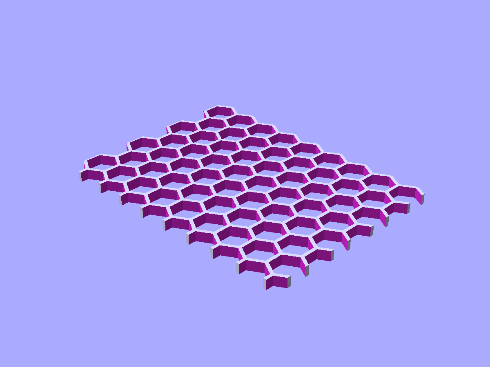
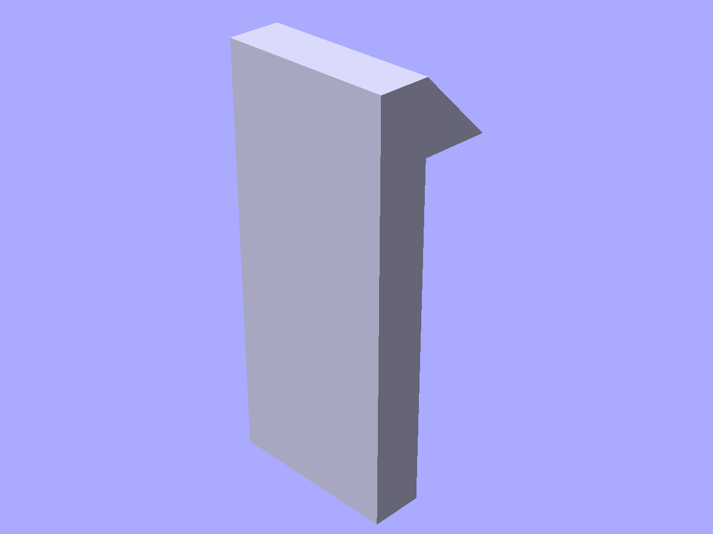

# Print-oriented shapes

Infill panels, text plates, vent slots, and mechanical joints for 3D-printed parts.

```python
from scadwright.shapes import (
    HoneycombPanel, GridPanel, TriGridPanel,
    TextPlate, EmbossedLabel,
    VentSlots,
    TabSlot, SnapHook, GripTab,
)
```

## Infill panels

### `HoneycombPanel(size, cell_size, wall_thk)`

Hex grid of holes in a rectangular slab. `size` is `(x, y, z)`.

```python
HoneycombPanel(size=(80, 60, 3), cell_size=8, wall_thk=1)
```



*`HoneycombPanel(size=(80, 60, 3), cell_size=8, wall_thk=1)` — hex-grid pierced slab for ventilation or weight reduction.*

### `GridPanel(size, cell_size, wall_thk)`

Square grid of holes.

```python
GridPanel(size=(60, 40, 2), cell_size=5, wall_thk=1)
```

### `TriGridPanel(size, cell_size, wall_thk)`

Triangular grid of holes.

```python
TriGridPanel(size=(60, 40, 2), cell_size=6, wall_thk=1)
```

## Text

### `TextPlate(label, plate_w, plate_h, plate_thk, depth, font_size)`

Plate with raised text on the surface.

```python
TextPlate(label="HELLO", plate_w=40, plate_h=15, plate_thk=2, depth=0.5, font_size=8)
```


*`TextPlate(label="HELLO", plate_w=40, plate_h=15, plate_thk=2, depth=0.8, font_size=8)` — raised text on a flat plate, useful for labels and tags.*

### `EmbossedLabel(label, plate_w, plate_h, plate_thk, depth, font_size)`

Plate with engraved (recessed) text.

```python
EmbossedLabel(label="v1.0", plate_w=30, plate_h=10, plate_thk=2, depth=0.3, font_size=6)
```

Both accept an optional `font` parameter (default `"Liberation Sans"`).

## `VentSlots(width, height, thk, slot_width, slot_height, slot_count)`

Rectangular panel with evenly-spaced horizontal vent slots.

```python
VentSlots(width=30, height=20, thk=2, slot_width=20, slot_height=1.5, slot_count=5)
```

## Joints

### `TabSlot(tab_w, tab_h, tab_d, clearance)`

Finger joint tab. Publishes `slot_w`, `slot_h`, `slot_d` for the matching pocket (tab dimensions + clearance).

```python
tab = TabSlot(tab_w=5, tab_h=3, tab_d=10, clearance=0.2)
pocket = cube([tab.slot_w, tab.slot_d, tab.slot_h])  # matching cutter
```

### `SnapHook(arm_length, hook_depth, hook_height, thk, width)`

Cantilever snap-fit hook. Triangular barb at the top of the arm has a flat catch (bottom) and a slanted ramp (top). Typical ramp is 45° (`hook_height == hook_depth`).

```python
SnapHook(arm_length=10, hook_depth=2, hook_height=2, thk=1.5, width=5)
```



*`SnapHook(arm_length=12, hook_depth=2, hook_height=2, thk=1.5, width=5)` — cantilever with a ramped barb; the arm flexes on insertion, the catch grips a ledge.*

### `GripTab(tab_w, tab_h, tab_d, taper)`

Press-fit tab for joining separately-printed parts. `taper` widens the base for grip.

```python
GripTab(tab_w=6, tab_h=4, tab_d=8, taper=0.5)
```
