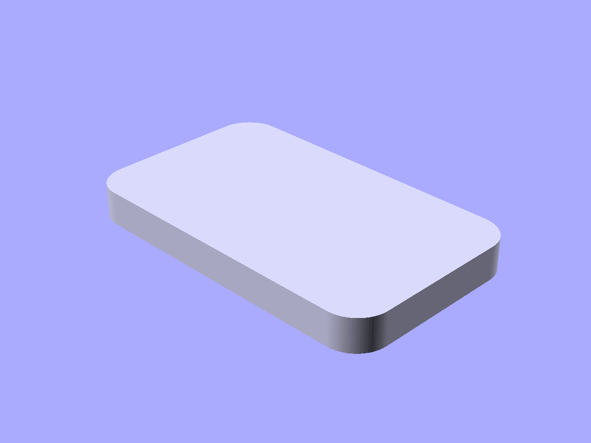
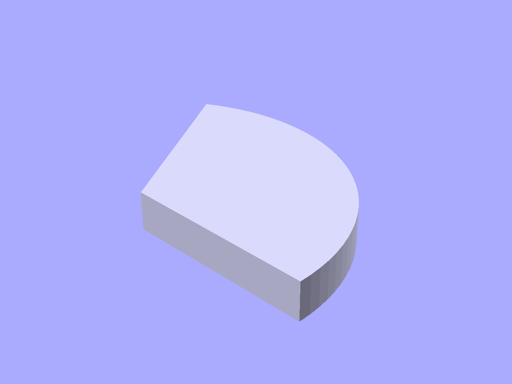
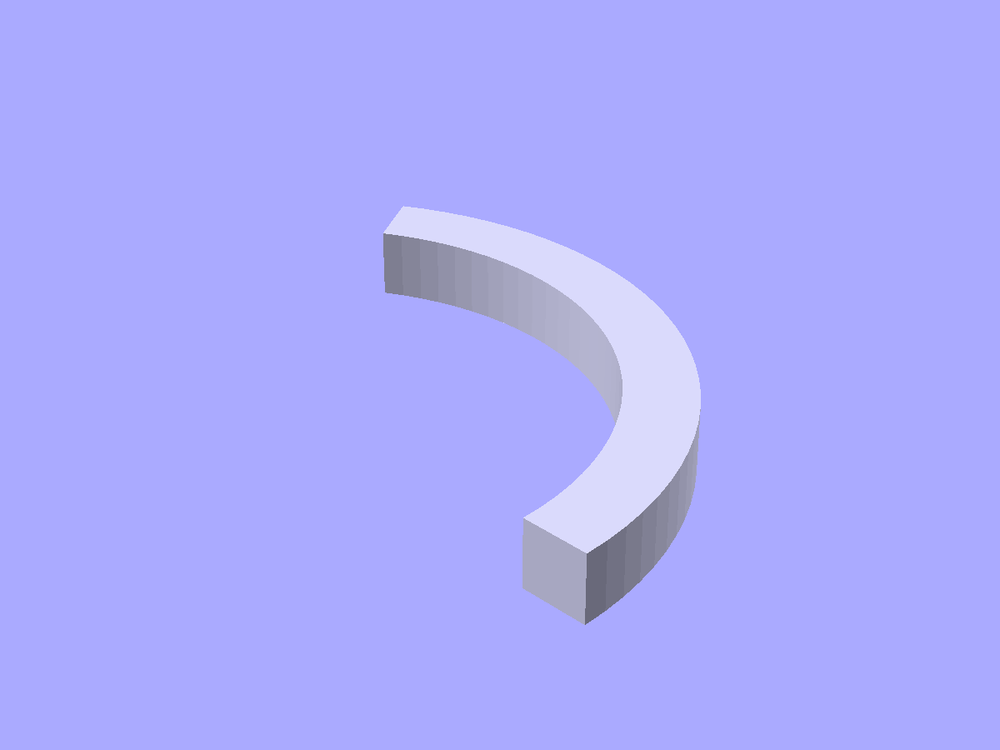
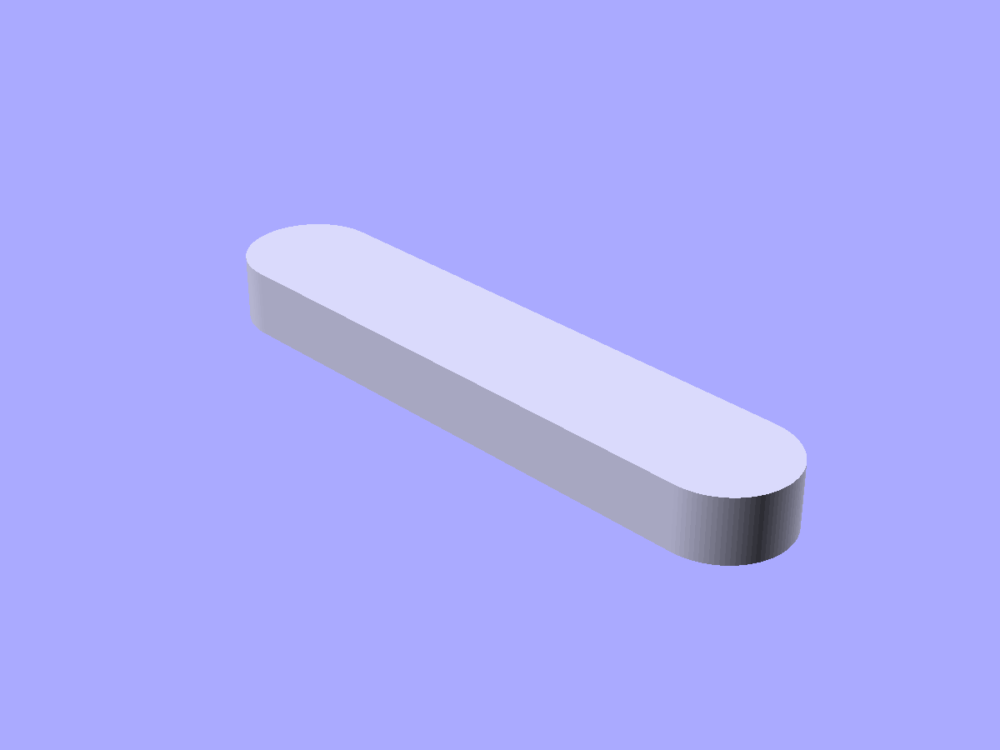
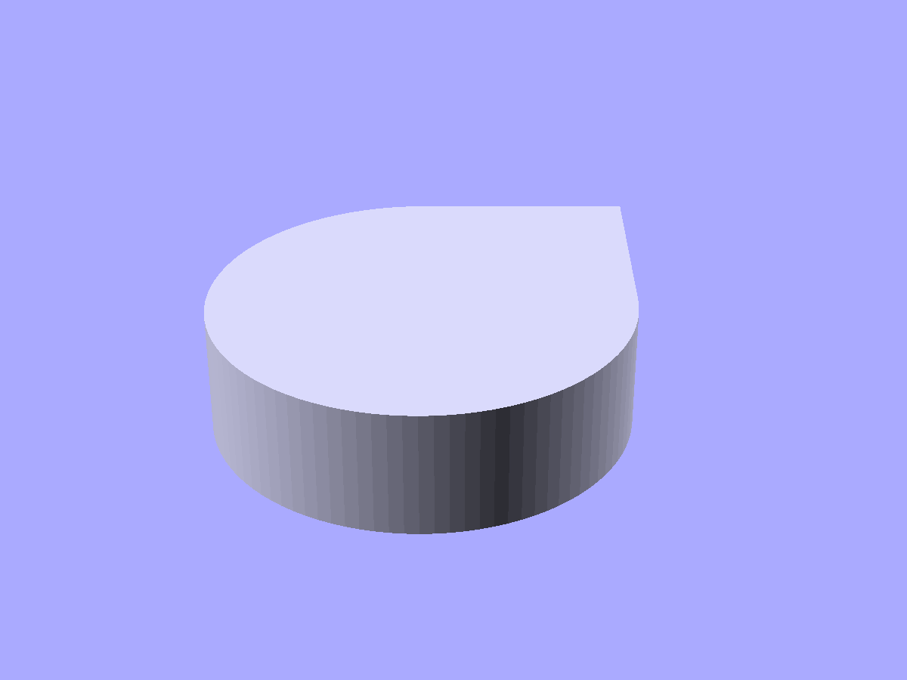
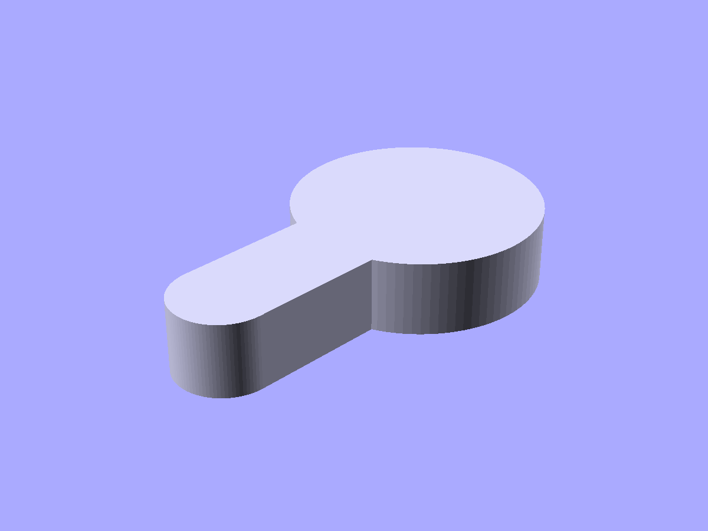

# 2D profiles

Factory functions and Components for common 2D shapes. Extrude them with `linear_extrude` or `rotate_extrude` to make 3D parts.

```python
from scadwright.shapes import (
    rounded_rect, rounded_square, regular_polygon,
    Sector, Arc, RoundedEndsArc, RoundedSlot,
    Teardrop, Keyhole, Annulus, Star,
)
```

## `rounded_rect(x, y, r, *, fn=None)`

Rectangle with rounded corners, centered on the origin. `r=0` falls back to a plain square.

```python
rounded_rect(20, 10, 2, fn=16)
```



*`rounded_rect(30, 18, 3).linear_extrude(height=3)` — shown extruded to read as a 3D plate.*

## `rounded_square(size, r, *, fn=None)`

Convenience wrapper around `rounded_rect`. `size` can be a single number (square) or `[w, h]`.

```python
rounded_square(10, 2)               # 10x10 with 2mm corner radius
rounded_square([20, 10], 2)         # 20x10
```

## `regular_polygon(sides, r)`

Regular n-sided polygon inscribed in a circle of radius `r`, centered on the origin. First vertex on the +X axis.

```python
regular_polygon(sides=6, r=5)       # hexagon
```

## `Sector(r, angles, fn=None)`

Pie slice cut from a disc.

```python
Sector(r=10, angles=(0, 60), fn=24)
```



*`Sector(r=15, angles=(0, 120)).linear_extrude(height=3)` — a 120° pie slice, extruded.*

## `Arc(r, angles, width, fn=None)`

Ring segment -- like a Sector but only the outer band. Published attributes: `inner_r`, `outer_r`.

```python
Arc(r=10, angles=(0, 90), width=2, fn=24)
```



*`Arc(r=15, angles=(0, 120), width=3).linear_extrude(height=3)` — a ring segment, extruded.*

## `RoundedEndsArc(r, angles, width, end_r, fn=None)`

An Arc with semicircular caps on its ends.

```python
RoundedEndsArc(r=10, angles=(0, 90), width=1, end_r=0.5, fn=24)
```

## `RoundedSlot(length, width, fn=None)`

Capsule / stadium shape: rectangle with semicircular caps on the short sides. When `length` equals `width`, the result is a circle.

```python
RoundedSlot(length=20, width=4, fn=16)
```



*`RoundedSlot(length=30, width=6).linear_extrude(height=3)` — a stadium/capsule profile, extruded.*

## `Teardrop(r, tip_angle=45, cap_h=None)`

FDM-friendly teardrop for horizontal holes. A circle with a tangent-line cap rising to a point at +y; the side walls slope at `tip_angle` above horizontal so the hole prints without support. `tip_angle=45` is the classic printable-hole default. Pass `cap_h` to truncate the tip with a flat horizontal cut. You can read `tip_height` (solved from `r` and `tip_angle`) off the instance.

```python
Teardrop(r=3)                           # classic 45° tip
Teardrop(r=3, tip_angle=30)             # shallower (more overhang, stronger print)
Teardrop(r=3, cap_h=4).linear_extrude(height=20)   # truncated, extruded into a hole cutter
```



*`Teardrop(r=5)` — the canonical horizontal-hole profile.*

## `Keyhole(r_big, r_slot, slot_length)`

Classic keyhole profile: a head of radius `r_big` with a narrower slot of half-width `r_slot` extending in -y for `slot_length`. Use for wall-mount holes that accept a screw head through the head, then slide down the slot to catch on the shoulder.

```python
Keyhole(r_big=5, r_slot=2, slot_length=10)
```



*`Keyhole(r_big=5, r_slot=2, slot_length=10)` — slot extends downward so the part slides onto a protruding screw.*

## `Annulus(id, od, thk)`

Flat 2D ring — the open-faced sibling of [`Tube`](tubes_and_shells.md#tubeh-idodthk). Centered on the origin. Specify any two of inner diameter, outer diameter, wall thickness; the framework solves the third (`od = id + 2·thk`).

```python
Annulus(id=8, od=12)      # thk solved = 2
Annulus(id=8, thk=2)      # od solved = 12
Annulus(od=12, thk=2)     # id solved = 8
```

Useful as a gasket cross-section, washer outline, or as the input to `linear_extrude` for a flat ring solid (`Annulus(...).linear_extrude(height=h)` is equivalent to the corresponding `Tube`).

## `Star(points, r_outer, r_inner)`

Regular n-pointed star with alternating outer (tip) and inner (valley) radii. The polygon has `2 * points` vertices; one tip points up (+y) by default. Both radii accept diameter alternatives (`d_outer = 2·r_outer`, `d_inner = 2·r_inner`).

```python
Star(points=5, r_outer=10, r_inner=4)        # five-point
Star(points=6, d_outer=24, d_inner=12)       # six-point via diameters
Star(points=5, r_outer=10, d_inner=8)        # mixed radius/diameter
```

`points` must be at least 3, and `r_inner` must be strictly less than `r_outer`. To rotate the orientation (e.g. to have a flat side up instead of a tip up), chain `.rotate([0, 0, deg])`.
