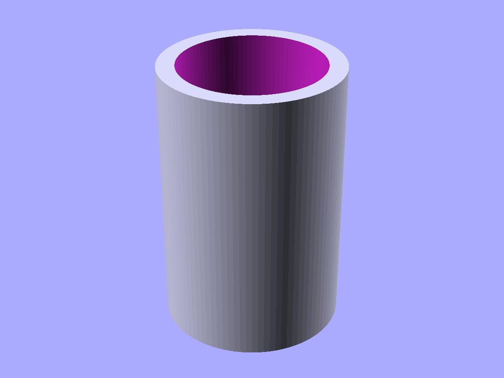
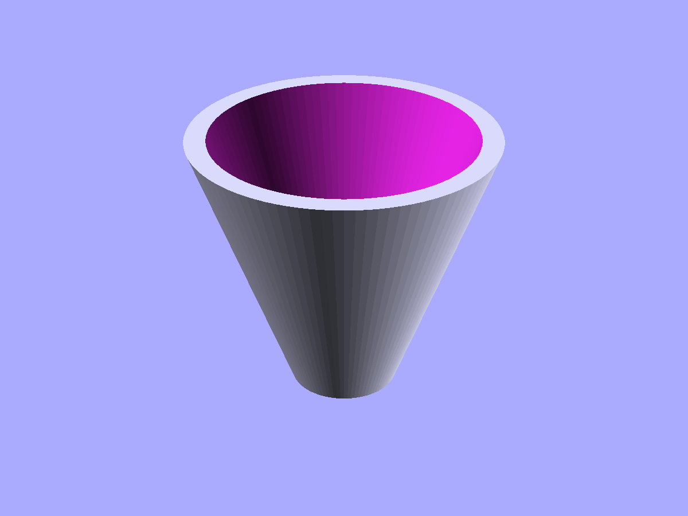
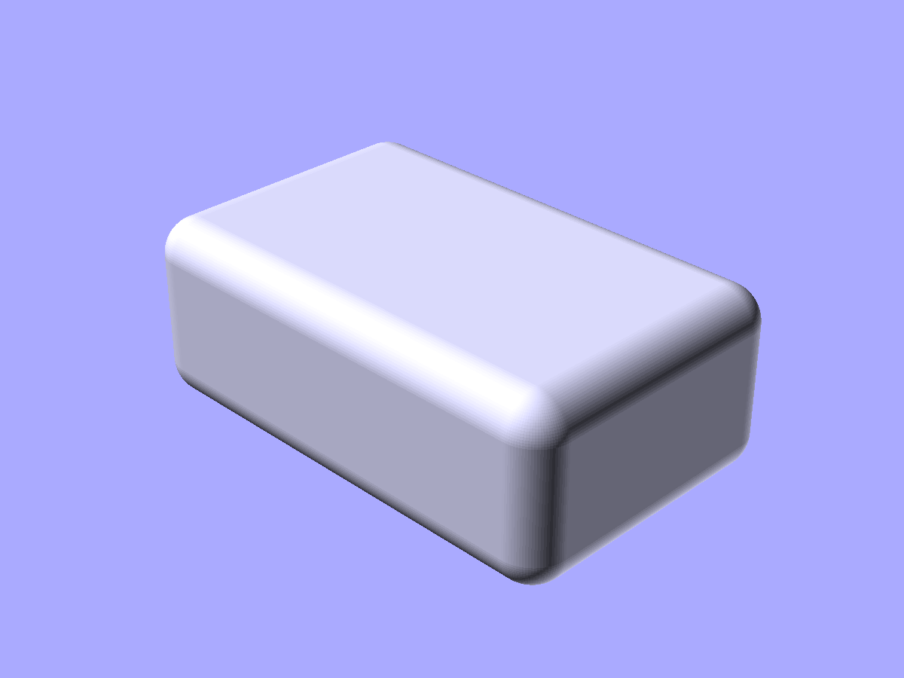
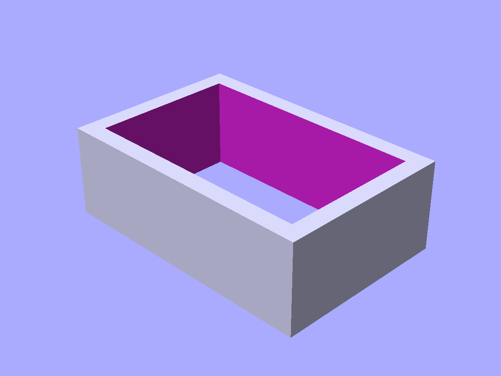

# Tubes and shells

Parametric hollow shapes with equation-driven dimensions.

```python
from scadwright.shapes import Tube, Funnel, RoundedBox, UShapeChannel, RectTube
```

## `Tube(h, id|od|thk)`

Hollow cylinder. Specify any two of inner diameter, outer diameter, and wall thickness; the framework solves the third.

```python
Tube(h=10, id=8, thk=1)      # od solved = 10
Tube(h=10, id=8, od=10)      # thk solved = 1
Tube(h=10, od=10, thk=1)     # id solved = 8
```



*`Tube(od=20, id=16, h=30)` — a thick-walled hollow cylinder.*

## `Funnel(h, thk, top_*, bot_*)`

Tapered tube. For each end, specify one of the inner or outer diameter.

```python
Funnel(h=20, thk=2, bot_id=10, top_id=14)
Funnel(h=20, thk=2, bot_od=14, top_od=18)
Funnel(h=20, thk=2, bot_id=10, top_od=18)    # mix and match
```



*`Funnel(h=30, thk=2, bot_id=8, top_id=30)` — a wide-top taper to a narrow bottom.*

## `RoundedBox(size, r)`

Box with all edges rounded by a sphere of radius `r`. Centered on the origin. Each `size` axis must be larger than `2*r`.

```python
RoundedBox(size=(20, 10, 5), r=1)
```



*`RoundedBox(size=(40, 25, 15), r=3)` — a box with every edge and corner smoothly filleted.*

## `UShapeChannel(channel_width, channel_height, outer_width, outer_height, wall_thk, channel_length)`

Three-sided rectangular channel with equation-driven dimensions. Specify `channel_length` plus any two cross-section params; the framework solves the rest. `n_shape=True` flips the opening downward.

```python
UShapeChannel(wall_thk=2, channel_length=20, channel_width=10)
UShapeChannel(wall_thk=2, channel_length=20, channel_width=10, n_shape=True)
```

Publishes `bottom_width`, `outer_width`, `outer_height`. Declares a `channel_opening` anchor at the center of the open face.

## `RectTube(outer_w, outer_d, inner_w, inner_d, wall_thk, h)`

Rectangular hollow tube. Two cross-section equations couple outer and inner by `wall_thk`, so any combination that fixes both per-axis dimensions is sufficient (e.g. `outer_w + wall_thk` → inner solved; `inner_w + outer_w` → wall_thk solved).

```python
RectTube(outer_w=30, outer_d=20, wall_thk=2, h=10)      # inner solved
RectTube(inner_w=20, inner_d=12, wall_thk=3, h=10)      # outer solved
```



*`RectTube(outer_w=30, outer_d=20, wall_thk=2, h=10)` — rectangular sibling of `Tube`.*
