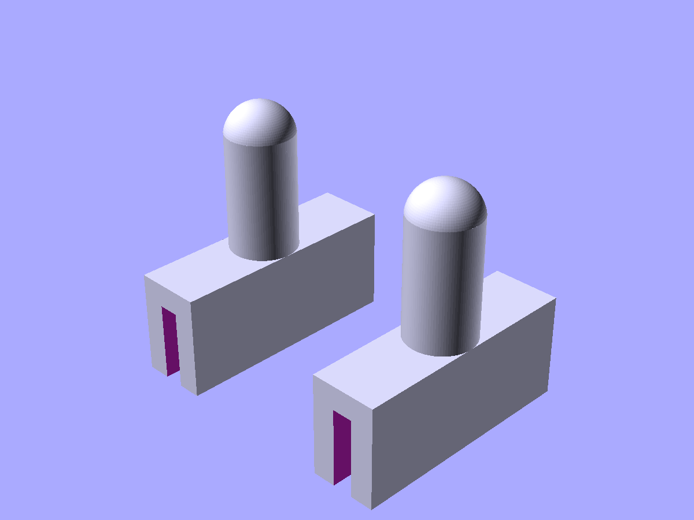
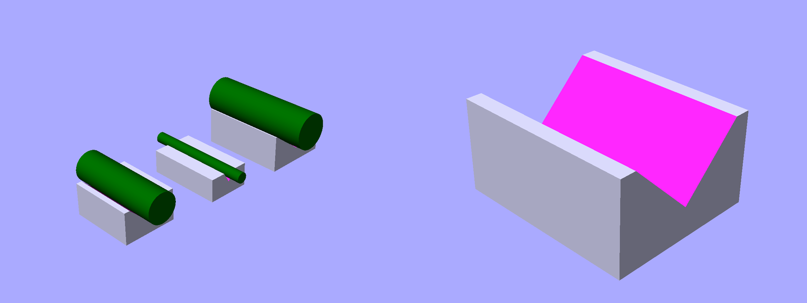
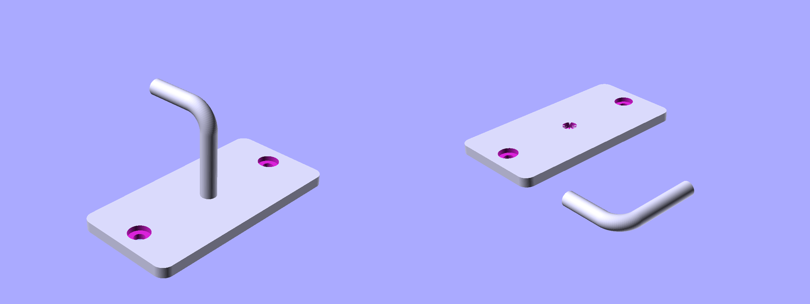
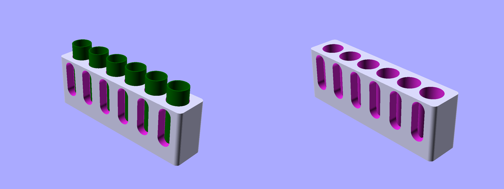
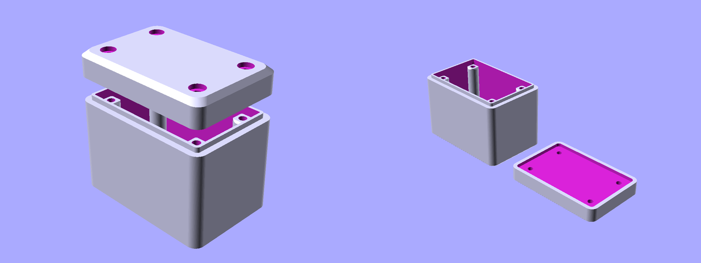
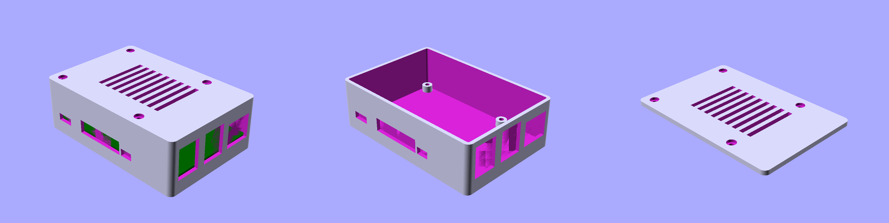
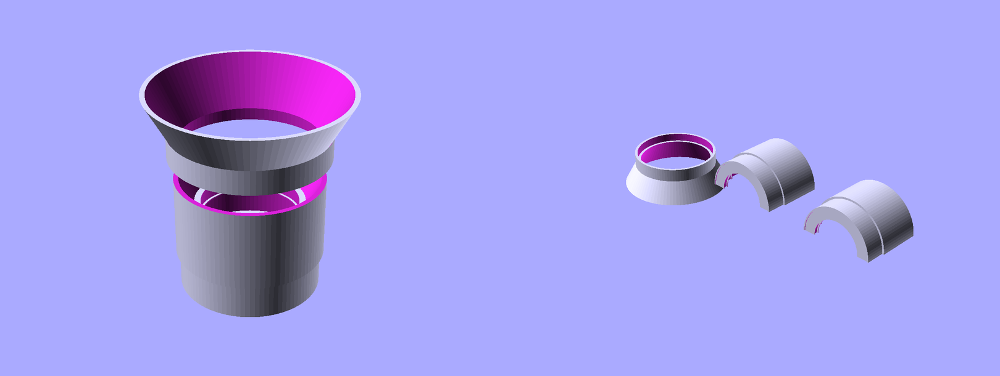

# SCADwright examples

Each file is a self-contained SCADwright project that renders to one or more `.scad` files you can open in OpenSCAD. Run them with either:

```
python examples/<name>.py                           # default variant
python examples/<name>.py --variant=<name>          # pick a specific variant
scadwright preview examples/<name>.py --variant=<name>
```

The examples are arranged below from simplest to most complex. Each one introduces new ideas on top of what earlier ones showed, so reading them in order is the recommended learning path. See also [Organizing a project](../docs/organizing_a_project.md) for how to structure your own projects.

| Complexity | File | What it shows |
| --- | --- | --- |
| Simple | [`simple-plate.py`](simple-plate.py) | A flat script: primitives, a boolean, and `render()`. No classes. |
| Simple | [`convex-caliper.py`](convex-caliper.py) | One primitive and two shape-library parts stacked with `attach()`. A one-variant `Design`. |
| Intermediate | [`v-block.py`](v-block.py) | Trigonometry inside `equations` (`sin`, `tan`). Three concrete subclasses, each pinning a different pair of values. |
| Intermediate | [`wall-hook.py`](wall-hook.py) | Two Components joined with `attach()` at a named anchor. |
| Intermediate | [`battery-holder.py`](battery-holder.py) | A `namedtuple` spec drives the design. A custom transform. One cradle per battery, via a list built inside `equations`. |
| Intermediate | [`box-and-lid.py`](box-and-lid.py) | A `Lid` that reads values off a `Box` (the `Box` is a parameter on the `Lid`). `build()` written as a series of `yield` lines. |
| Complex | [`electronics-case.py`](electronics-case.py) | `namedtuple` specs for the PCB and its ports. Three custom transforms. Separate variants for print vs. display. |
| Complex | [`lens-housing.py`](lens-housing.py) | A helper that turns each lens element into a record with precomputed fields. A conditional that picks between two body shapes. A `halve()` section view in the print variant. |

---

## 0. [`simple-plate.py`](simple-plate.py)

A plate with two holes. No Components, no Design: just primitives, booleans, and a `render()` call. This is the simplest possible SCADwright script and shows that SCADwright starts looking like OpenSCAD code.

- `render()` writes a `.scad` file directly from a shape expression. No Design class needed for flat scripts.
- `difference()` takes one main shape followed by any number of cutters.
- `.left()` and `.right()` for single-axis offsets, shorter than `.translate([x, 0, 0])`.
- `center="xy"` on a primitive puts its X and Y origin at its center.

**Reference:** [primitives](../docs/primitives_3d.md) · [CSG operations](../docs/csg.md) · [directional helpers](../docs/transformations.md) · [organizing a project (Stage 1)](../docs/organizing_a_project.md#stage-1-flat-script)

---

## 1. [`convex-caliper.py`](convex-caliper.py)

A tool that slips over the jaws of a measuring caliper so it can span a part whose outer faces are both concave: the central thickness of a biconcave lens, or the web left between two opposing countersunk holes drilled from each side of a plate. The spherical-cap feeler nests into each concavity so the caliper reads the distance between the feelers' outer domes. One primitive (`cylinder`) and two shape-library Components (`UShapeChannel`, `SphericalCap`) stacked with `attach()`.

- `attach()` stacks each piece on top of the previous one with no manual z-offsets.
- Each shape-library part's dimensions are readable from outside (`clip.bottom_width`, `clip.outer_width`), so later code can size itself off them.
- `center="xy"` on the `UShapeChannel` keeps the stacked head symmetric around the X axis before the mirrored-pair split.
- A one-variant `Design`: the `print` variant lays a mirrored pair side-by-side so both halves print in one job.



*Print variant: two mirrored heads on the bed, one per caliper jaw.*

**Reference:** [shape library](../docs/shapes/README.md) · [attach()](../docs/anchors.md#basic-usage) · [Design + @variant](../docs/variants.md) · [centering](../docs/components.md#centering-with-center)

---

## 2. [`v-block.py`](v-block.py)

A machinist's V-block: a rectangular block with a V-shaped groove along its length, sized to cradle round stock tangent to both groove faces. Three concrete blocks, each pinned by a different pair of primary variables; the equations solve the rest.

- `sin` and `tan` inside `equations` relate the groove angle, the rod diameter it cradles, and the opening width at the top.
- Physical bounds live in the same `equations` list: `angle < 180`, `groove_depth < block_h`, `contact_width < block_w`.
- Three concrete subclasses, each fixing a different pair of values: `(angle, max_d)`, `(angle, groove_depth)`, `(max_d, groove_depth)`. The solver fills in the rest.
- Chained `.through(parent, axis="x").through(parent, axis="z")` on the V-cutter extends it automatically at both ends and the top. No manual EPS.

```python
equations = [
    "half_angle = angle / 2",
    "max_d = 2 * groove_depth * sin(half_angle * pi / 180)",
    "contact_width = 2 * groove_depth * tan(half_angle * pi / 180)",
    "angle, max_d, groove_depth, contact_width, block_w, block_l, block_h > 0",
    "angle < 180",
    "groove_depth < block_h",
    "contact_width < block_w",
]
```



*Left: display variant with three V-blocks, each holding a rod. Different specification pairs produce different angles, depths, and rod capacities. Right: print variant, a single V-block.*

**Reference:** [the equations list](../docs/components.md#parameters-the-equations-list) · [through()](../docs/auto-eps_fuse_and_through.md) · [concrete subclasses](../docs/organizing_a_project.md#concrete-subclasses)

---

## 3. [`wall-hook.py`](wall-hook.py)

A wall-mount coat hook: a plate with two countersunk screw holes and a J-hook that attaches via a named anchor. Two small Components joined by `attach()` at a specific anchor on the parent, with no manual coordinate math.

- Both Components declare named anchors at class scope with `anchor(at=..., normal=...)`: `WallPlate.hook_mount` and `JHook.base`.
- A second anchor (`WallPlate.top_edge`) is declared for future use, showing that a reusable Component can offer several attachment points.
- `attach(parent, face="hook_mount", fuse=True)` picks the named anchor on the parent. The two anchors' normals already oppose, so no `orient=True` is needed.
- `Torus(angle=90)` from the shape library makes a smooth quarter-toroid elbow between the stem and the tip.
- `.through(parent, axis="z")` on both the screw-hole shafts and the countersink cutters extends them automatically with no manual EPS.



*Left: display variant, plate with J-hook attached at `hook_mount`. Right: print variant, plate and hook laid flat on the bed.*

**Reference:** [anchors and attach()](../docs/anchors.md) · [attach(fuse=True)](../docs/auto-eps_fuse_and_through.md) · [through()](../docs/auto-eps_fuse_and_through.md) · [variants](../docs/variants.md)

---

## 4. [`battery-holder.py`](battery-holder.py)

A desk-tray battery caddy: N cylindrical cells of a chosen type sit in wells along a rounded-corner tray. Each well has a tall rounded-slot finger window in the outer wall, oriented along the battery's long axis, so you can see the cell and pinch it out from the side.

- `Param(BatterySpec)` accepts a `namedtuple` with one battery's dimensions. Passing `AA` instead of `AAA` reuses the Component unchanged.
- A custom transform (`@transform("finger_scoop", inline=True)`) is applied once per cradle, extruding a shape-library 2D profile (`RoundedSlot`) into the cutter shape.
- Lines in `equations` compute `pitch`, `outer_w`, `outer_l`, and the list of `cradle_positions` directly from the spec.
- A validation rule in `equations` (`"tray_depth < spec.length"`) makes sure the tray isn't deeper than the battery is long.
- Per-battery concrete subclasses (`AA6Holder`, `Holder18650x4`), each with its own dimensions as class attributes.
- A `print` variant and a `display` variant.



*Left: display variant, six ghost AA cells seated in their cradles with tops protruding above the tray. Right: print variant, the bare tray showing the cradle geometry.*

**Reference:** [Param() for non-floats](../docs/components.md#param-for-non-floats-and-defaults) · [custom transforms](../docs/custom_transforms.md) · [the equations list](../docs/components.md#parameters-the-equations-list) · [variants](../docs/variants.md) · [shape library](../docs/shapes/README.md)

---

## 5. [`box-and-lid.py`](box-and-lid.py)

A snap-on enclosure: a rounded-corner box with chamfered bottom edges and four interior screw pylons, plus a matching lid with countersunk corner holes and a centering lip that rises from the inner rim into a recess in the lid.

- `Lid` takes a `Box` as a parameter and reads dimensions off it: `box.outer_w`, `box.pylon_positions`, `box.screw`, `box.inner_corner_r`.
- `build()` uses `yield` lines, one per part; SCADwright joins them into the final shape.
- A custom transform (`chamfer_top`) uses `bbox()` to size itself to whatever shape it's applied to.
- The `equations` list combines an equation (`inner_w = outer_w - 2*wall_thk`), bounds on several dimensions, and a comparison between dimensions (`lip_thk < wall_thk`).
- `.through(parent)` on the lip cutout and the lid recess extends them automatically with no manual EPS.



*Left: display variant, lid floated above the box with the centering lip and pylons visible through the gap. Right: print variant, box and inverted lid laid out on the bed.*

**Reference:** [Param(Component)](../docs/components.md#param-for-non-floats-and-defaults) · [yielding pieces](../docs/components.md#yielding-pieces) · [custom transforms](../docs/custom_transforms.md) · [through()](../docs/auto-eps_fuse_and_through.md) · [bbox()](../docs/introspection.md#bounding-boxes)

---

## 6. [`electronics-case.py`](electronics-case.py)

A parametric 3D-printable case for a Raspberry Pi 4. Base tray with standoffs at the PCB's mount holes, port cutouts for USB, HDMI, audio, and Ethernet connectors, and a screw-on lid with a ventilation slot array.

- `PCBSpec` and `PortSpec` (plain `namedtuple`s) carry all the dimensions. Swapping an `ArduinoUno` spec in would produce a valid Arduino case with no Component changes.
- Three custom transforms (`port_cutout`, `countersunk_hole`, `vent_slot_array`), each applied many times. All three size themselves from whatever shape they're applied to, using `bbox(node)` and `through(node, axis=...)`.
- `CaseLid` reads values off the base Component: `base.mount_positions`, `base.outer_size`.
- Three variants: `print_base` and `print_lid` are bed-ready orientations; `display` is the assembled view.
- One standoff per mount hole in the spec, one port cutout per `PortSpec` in the port list.



*Left to right: display variant (assembled, PCB visible through the port cutouts), `print_base` (the tray alone, as it sits on the bed), `print_lid` (the lid flipped for the bed).*

**Reference:** [custom transforms](../docs/custom_transforms.md) · [through()](../docs/auto-eps_fuse_and_through.md) · [bbox()](../docs/introspection.md#bounding-boxes) · [variants](../docs/variants.md) · [organizing a project](../docs/organizing_a_project.md)

---

## 7. [`lens-housing.py`](lens-housing.py)

An M57-threaded optical lens barrel: holds three stacked lens elements in grip-lip holders, with an expansion funnel for an element that's wider than the throat, and a front fillet that continues the cone angle of a matching clip-on hood.

- An `element(...)` helper precomputes each lens element's geometric fields (`face_z_top`, `face_z_bot`, `constricted`, `throat_dia_required`) so the housing's `equations` list can read them directly.
- A conditional in `equations` picks between two body shapes: `upper_housing_od = (max_upper_ele_dia + barrel_thk) if is_wide else flange_flange_od` chooses a funnel-flared barrel when an element is wide, a straight barrel otherwise.
- An `Element` `namedtuple` drives the list of lens elements. A single validation rule in `equations` checks that every constricted element fits the throat: `"all(not e.constricted or e.throat_dia_required <= lower_housing_id for e in elements)"`.
- `halve(...).rotate(...)` cuts the housing in half for a clean section view in the print variant.
- `attach(parent, fuse=True)` stacks barrel segments. The `display` variant uses `bbox(self.housing)` to find the true top of the housing, since the front fillet extends beyond `upper_housing_len`.
- A `trunc_fillet_ring()` helper at module level returns a composed shape directly: an alternative to writing a custom transform.



*Left: display variant, housing with clip-on hood floated above it. Right: print variant, housing halved and splayed for a section view alongside the inverted hood.*

**Reference:** [the equations list](../docs/components.md#parameters-the-equations-list) · [halve()](../docs/composition_helpers.md#halve) · [attach(fuse=True)](../docs/auto-eps_fuse_and_through.md) · [bbox()](../docs/introspection.md#bounding-boxes)

---

## Appendix: original source

[`s2-lens-v2b.scad`](s2-lens-v2b.scad) is the pre-SCADwright OpenSCAD file that `lens-housing.py` was ported from. Useful as a side-by-side read: roughly the same geometry in 463 lines of SCAD vs. ~320 lines of Python.
