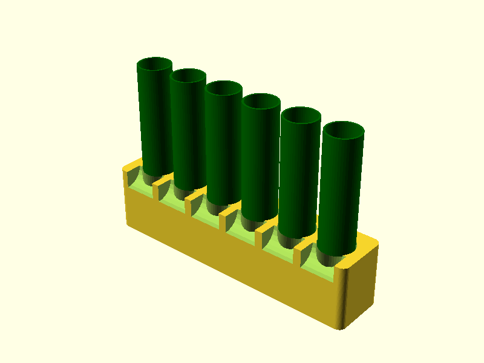
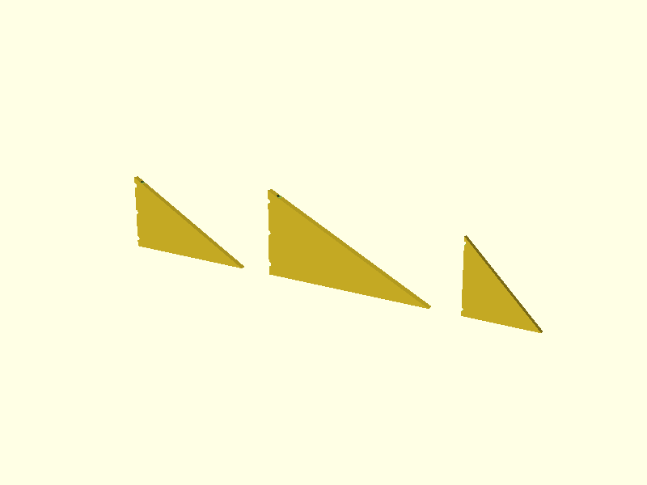
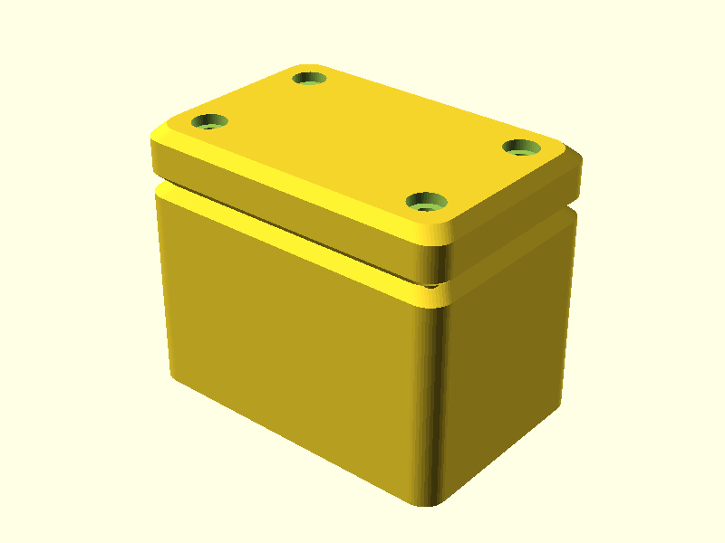
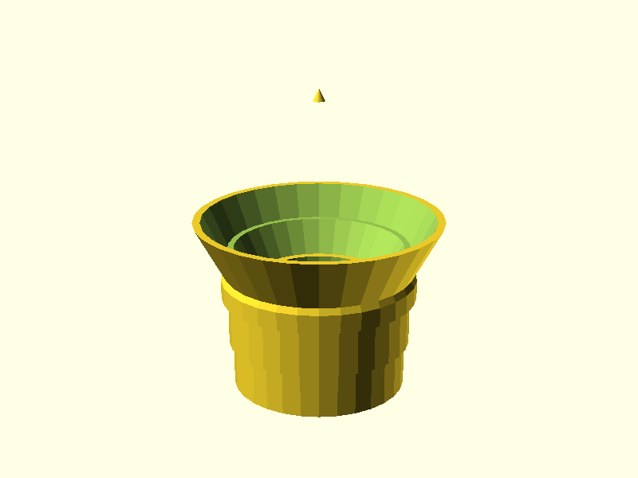
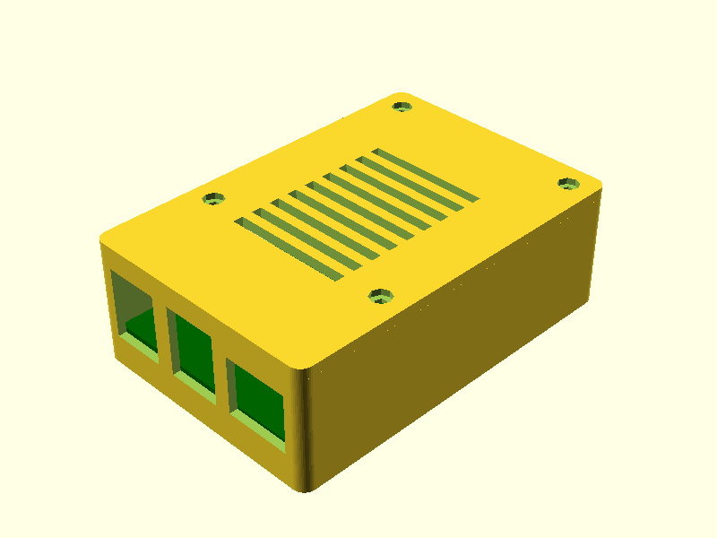

# scadwright examples

Each file is a self-contained scadwright project that renders to one or more `.scad` files you can open in OpenSCAD. Run them with either:

```
python examples/<name>.py                           # default variant
python examples/<name>.py --variant=<name>          # pick a specific variant
scadwright preview examples/<name>.py --variant=<name>
```

The examples are arranged below from simplest to most complex. Each one introduces new ideas on top of what earlier ones showed, so reading them in order is the recommended learning path. See also [Organizing a project](../docs/organizing_a_project.md) for how to structure your own projects.

| Complexity | File | What it demonstrates |
| --- | --- | --- |
| Simple | [`simple-plate.py`](simple-plate.py) | Flat script, no Components -- primitives + booleans + render |
| Intermediate | [`battery-holder.py`](battery-holder.py) | Custom transform per cradle, multi-instantiation, concrete subclass per battery type |
| Intermediate | [`shelf-bracket.py`](shelf-bracket.py) | Equation solving with trig, three concrete brackets each specified via a different pair |
| Intermediate | [`box-and-lid.py`](box-and-lid.py) | Generator `build()`, cross-Component publishing, equations, print/display variants |
| Intermediate | [`lens-housing.py`](lens-housing.py) | Multiple instantiation (element stack), `halve` for section view, equations |
| Complex | [`electronics-case.py`](electronics-case.py) | Spec namedtuples, three custom transforms, multi-variant print-splitting |

---

## 0. [`simple-plate.py`](simple-plate.py)

A plate with two holes. No Components, no Design -- just primitives, booleans, and a `render()` call. This is the simplest possible scadwright script and shows that scadwright starts looking like OpenSCAD code.

---

## 1. [`battery-holder.py`](battery-holder.py)

A desk-tray battery caddy: N cylindrical cells of a chosen type sit in wells along a rounded-corner tray. Each well has a half-cylinder finger-scoop in the outer wall so you can pinch and lift a battery out.

- Custom transform (`@transform("finger_scoop")`) applied once per cradle
- `params` declaring six shared-type floats
- Per-battery concrete subclasses (`AA6Holder`, `Holder18650x4`)
- Dimension derivation in `setup`; multi-instantiation from a computed `cradle_positions` list
- Print and display `@variant`s


*display variant -- six ghost AA cells protruding above the tray to illustrate how the finger-scoops line up*

---

## 2. [`shelf-bracket.py`](shelf-bracket.py)

A right-triangular gusset bracket for supporting a wall shelf. Three concrete brackets of different sizes, each specified via a different pair of the four geometric variables.

- Equation solving with trig -- four variables (`rise`, `run`, `hyp`, `angle`) constrained by two equations; specify any two, the framework solves the other two
- Inequality constraints (`"rise, run, hyp, angle > 0"`)
- Custom transform for mount holes
- Three concrete subclasses each filling in a different pair: `(run, angle)`, `(rise, run)`, `(hyp, angle)`

```python
equations = [
    "rise**2 + run**2 == hyp**2",
    "rise == run * tan(angle * pi / 180)",
    "rise, run, hyp, angle, thk, mount_hole_d, mount_inset > 0",
]
```


*display variant -- three brackets, each specified by a different pair of (rise, run, hyp, angle), with the remaining two solved*

---

## 3. [`box-and-lid.py`](box-and-lid.py)

A snap-on enclosure: a rounded-corner box with chamfered top/bottom edges and four interior screw pylons, plus a matching lid with countersunk corner holes and a centering lip that drops into the box mouth.

- Cross-Component dimension publishing -- `Lid` takes a `Box` instance as a Param and reads `box.outer_size`, `box.pylon_positions`, `box.screw` directly off it
- Custom transform (`chamfer_top`) applied to pylon tops
- Generator-style `build()` yielding parts to be auto-unioned
- Concrete subclasses (`MyBox`, `MyLid`) in the CONCRETE zone
- `params` with inequality constraints for positive and non-negative groups


*display variant -- lid seated on the box, its centering lip dropped into the mouth*

---

## 4. [`lens-housing.py`](lens-housing.py)

An M57-threaded optical lens barrel: holds three stacked lens elements in grip-lip holders, with an expansion funnel for an element that's wider than the throat, a front fillet that continues the cone angle of a matching clip-on hood.

- `halve` composition helper producing a clean section view in the print variant
- `@classmethod` on `ElementHolder` to query dimensions before instantiation -- the classic chicken-and-egg pattern when one component's dimensions depend on another's
- `Element` namedtuple driving multi-instantiation (one holder per element)
- Derived dimensions computed in `setup`
- Concrete subclasses (`M57LensHousing`, `M57LensHood`); print-variant splay plus assembled display variant


*display variant -- housing with clip-on hood mated on top, viewed from above*

---

## 5. [`electronics-case.py`](electronics-case.py)

A parametric 3D-printable case for a Raspberry Pi 4. Base tray with standoffs at the PCB's mount holes, port cutouts for USB, HDMI, audio, and Ethernet connectors, and a screw-on lid with a ventilation slot array.

- Spec dataclasses (`PCBSpec`, `PortSpec`) as data contracts -- swapping in an `ArduinoUno` spec would produce a valid Arduino case with no Component changes
- Three custom transforms (`port_cutout`, `countersunk_hole`, `vent_slot_array`) each applied many times
- Cross-Component publishing -- `CaseLid` reads `base.mount_positions`, `base.outer_size`
- Multi-variant print-splitting: `print_base` and `print_lid` are bed-ready orientations, `display` is the assembled view
- Multi-instantiation driven by spec data (one standoff per mount hole, one port cutout per `PortSpec`)


*display variant -- lid sitting on the assembled case, vents on top, PCB stand-in visible through the port cutouts on the sides*

---

## Appendix: original source

[`s2-lens-v2b.scad`](s2-lens-v2b.scad) is the pre-scadwright OpenSCAD file that `lens-housing.py` was ported from. Useful as a side-by-side read: roughly the same geometry in 463 lines of SCAD vs. ~320 lines of Python.
